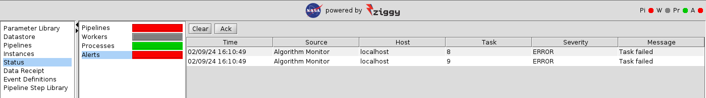

<!-- -*-visual-line-*- -->

[[Previous]](monitoring.md)
[[Up]](ziggy-gui-troubleshooting.md)
[[Next]](display-logs.md)

## Alerts Panel

Ziggy uses alerts to tell the pipeline operator that something has happened that they ought to know about. Alerts are displayed on the `Alerts` status panel. It looks like this:

There are two flavors of alert that you're likely to see: warnings and errors. Warnings will turn the alerts stoplight yellow, errors turn it red. The alerts panel shows which task generated the alert, when it happened, and a hopefully-useful message. If there are no alerts, the stoplight will be green. 

Sadly, in this case it tells you pretty much what you already knew: task 12 blew up. 

### Acknowledging Alerts

Once an alert arrives, the stoplight color will stay whatever color is appropriate for that alert (at least it will stay that color until another alert comes in). This may not be convenient: once you've dealt with whatever problem caused the alert, you'll want to start running again; at which point you'll want the alert stoplight to be green again so you can see if any new alerts come in, rather than staying yellow or red because of some issue that's already been fixed. To make the stoplight color turn back to green, use the `Ack` button. The alerts will still be shown on the table but the stoplight will return to green.

### Clearing Alerts

Alternately, once an alert is addressed you may want to get it completely out of the table of alerts. The `Clear` button will clear all alerts from the display and return the stoplight to green. 

[[Previous]](monitoring.md)
[[Up]](ziggy-gui-troubleshooting.md)
[[Next]](display-logs.md)
