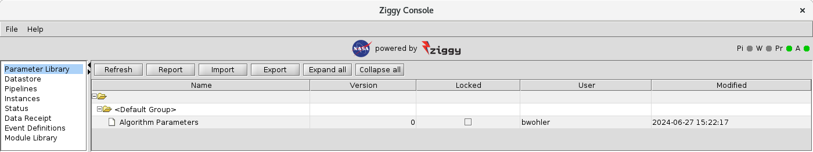

<!-- -*-visual-line-*- -->

[[Previous]](start-end-nodes.md)
[[Up]](ziggy-gui.md)
[[Next]](intermediate-topics.md)

## Changing Module Parameter Values

To see how this works, go back to the `Configuration` tab and select the `Parameter Library` option from the menu on the left hand side. You'll see this:

As you can see, all of the parameter sets defined in `pl-sample.xml` are represented here. What else does the table tell us?

- The `Type` column is the name of the Java class that supports the module parameter set. For now you can ignore this.
- The `Version` column shows the current version of the parameter set. They all show zero because none of the parameter sets has been modified since they were imported from `pl-sample.xml`.
- The `Locked` column shows whether the current version of each parameter set is locked. What that means is this: before a version of a parameter set is used in the pipeline, it's unlocked, and the user can make changes to it; once the version has been used in processing, that version becomes locked, and any changes the user makes will create a new version (that is unused, hence unlocked). The versioning and locking features allow Ziggy to preserve a permanent record of the parameters used in each instance of each pipeline.

Now: double-click the Algorithm Parameters row in the table. You'll get a new dialog box:

The parameters that were defined as booleans in `pl-sample.xml` have check boxes you can check or uncheck. The other parameter types mostly behave the way you expect, but the array types offer some additional capabilities. If you click the `dummy array parameter` parameter, it will change thusly:

If you click the "X", all the values will be deleted, which is rarely what you want. Instead click the other button. You'll get this window:

This allows you to edit the array elements, remove them, add elements, etc., in a more GUI-natural way. Go ahead and change the second element (`idx` of 1) to 4. Click `ok`, then on the Edit Parameter Set dialog click `Save`. The `Version` for Algorithm Parameters will now be set to 1, and the `Locked` checkbox is unchecked.

If you were to now run the sample pipeline, when you returned to the parameter library window, version 1 of `Algorithm Parameters` will show as locked.

[[Previous]](start-end-nodes.md)
[[Up]](ziggy-gui.md)
[[Next]](intermediate-topics.md)
