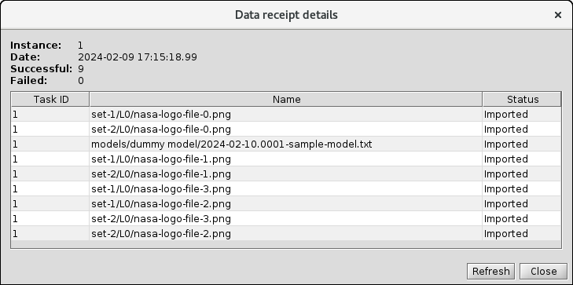

<!-- -*-visual-line-*- -->

[[Previous]](data-receipt.md)
[[Up]](advanced-topics.md)
[[Next]](event-handler-intro.md)

## Data Receipt Display

The console has the ability to display data receipt activities. From the `Configuration` tab, expand the `Data Receipt` folder and select `Available Datasets`. You'll see something like this:

Double-clicking a row in the table brings up a display of all the files in the dataset:

Note that the file names are the datastore names. 

[[Previous]](data-receipt.md)
[[Up]](advanced-topics.md)
[[Next]](event-handler-intro.md)
