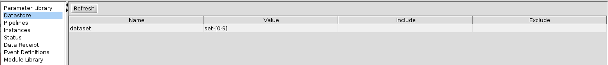
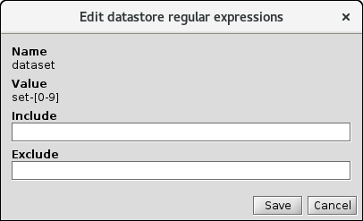

<!-- -*-visual-line-*- -->

[[Previous]](edit-pipeline.md)
[[Up]](ziggy-gui.md)
[[Next]](intermediate-topics.md)

## The Datastore Control Panel

If you click on the `Datastore` link in the console's navigation panel, you'll see this:

The first two columns make good sense: we have one `DatastoreRegexp` instance, with name `dataset` and value `set-[0-9]`. The last two columns aren't self-explanatory, but to find out what they are and how they work, double-click the `dataset` row. You'll see the following dialog box:

It looks like you can enter text into these boxes, and indeed you can:

If you now press `Save`, here's what you see back on the main panel:

If you were now to run the sample pipeline, you would notice something interesting: Ziggy only creates one task for each module, and that task is the `set-1` task! What you have done by adding `set-1` as an include regexp is you've added a condition to the `dataset` DatastoreRegexp: when it sweeps through the directories to generate units of work, the `dataset` level directories need to match the `dataset` value but also match its include regexp. 

The exclude regexp, by symmetry, does the opposite: only `dataset` level directories that do not match this regular expression can be included. Rather than setting the include to `set-1`, we could have left the include blank and set the exclude to `set-[02-9]`. 

Going back to the ludicrous example from [the Instances Panel article](instances-panel.md), we can now see how we would go about limiting the pipeline to running only tasks where `guitar` equals `reeves` and `album` equals either `outside` or `stardust`. We would go to the regular expressions panel and set the `guitar` `DatastoreRegexp` include value to `reeves`; we would then set the `album` include regexp to `outside|stardust`. 

[[Previous]](edit-pipeline.md)
[[Up]](ziggy-gui.md)
[[Next]](intermediate-topics.md)