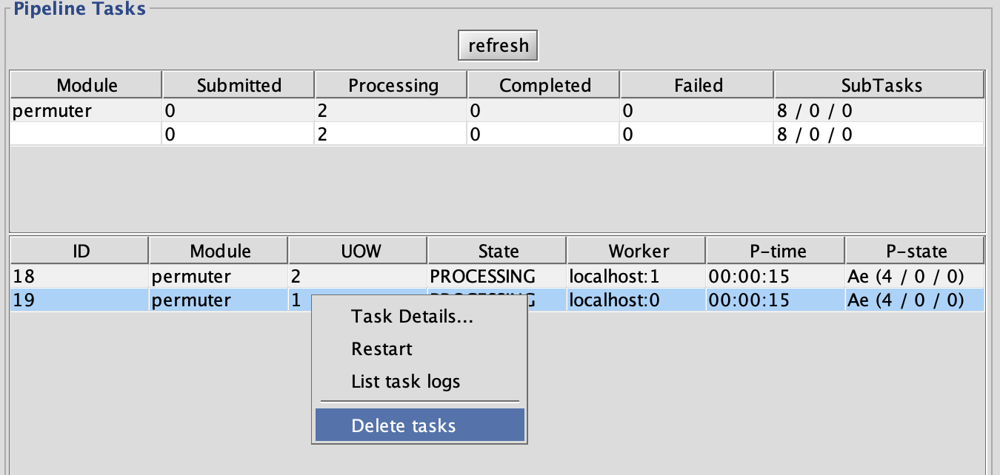
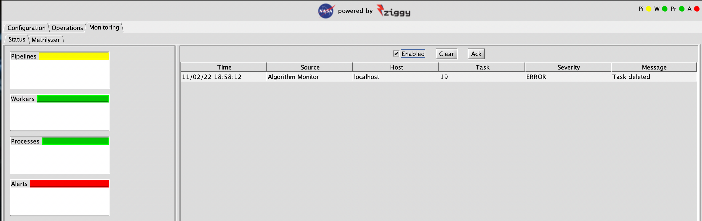

[[Previous]](hpc-cost.md)
[[Up]](advanced-topics.md)
[[Next]](data-receipt.md)

## Deleting Tasks

Sometimes it's necessary to stop the execution of tasks after they start running. Tasks that are running as jobs under control of a batch system at an HPC facility will provide command line tools for this, but they're a hassle to use when you're trying to delete a large number of jobs. Trying to delete tasks running locally is likewise hassle-tastic. 

Fortunately, Ziggy will let you do this from the console. 

### Delete all Jobs for a Task

To delete all jobs for a task, go to the tasks table on the Instances panel, right click the task, and select `Delete tasks` from the pop-up menu:

You'll be prompted to confirm that you want to delete the task. When you do that, you'll see something like this:

The state of the task will be immediately moved to `ERROR`, P-state `ALGORITHM_COMPLETE`. The instance will go to state `ERRORS_RUNNING` because the other task is still running; once it completes, the instance will go to `ERRORS_STALLED`. Meanwhile, the alert looks like this:

As expected, it notifies you that the task stopped due to deletion and not due to an error of some kind. 

### Delete all Tasks for an Instance

This is the same idea, except it's the pop-up menu for the instance table, and you select `Delete all tasks`.

[[Previous]](hpc-cost.md)
[[Up]](advanced-topics.md)
[[Next]](data-receipt.md)
