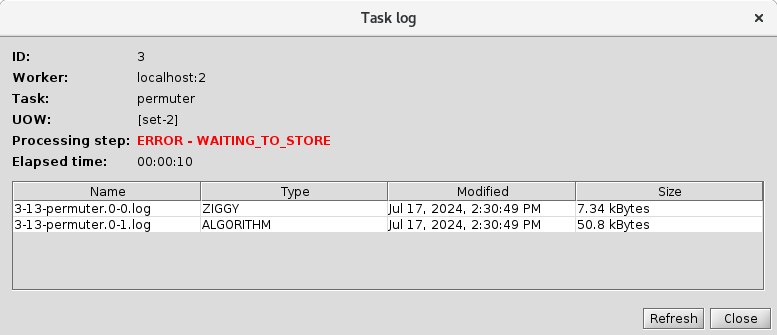
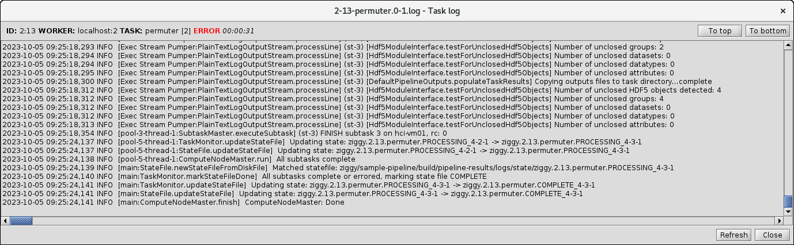
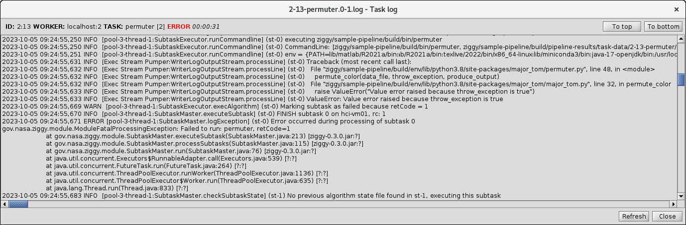

[[Previous]](alerts.md)
[[Up]](ziggy-gui-troubleshooting.md)
[[Next]](rerun-task.md)

## Log Files Display

Ziggy provides a mechanism for viewing task logs that is more convenient than going to the `logs` directory and hunting around.

To use this feature, go to the Instance tab under the Operations tab. Select the task of interest and right-click to bring up the tasks menu:

Select `List task logs`. You'll get this dialog box:

By default the logs are ordered by name, which means that they're also ordered by time, from earliest to latest. If you double-click on one of the rows in the table, the log file in question will be opened in a new window:

The log will always be opened with the view positioned at the end of the log, since that's most often where you can find messages that inform you about the problems. In this case, that's not true, so you can use the `To Top` button to jump to the start of the log, or simply scroll around until you find what you're looking for:

Here you can see the stack trace produced by the Python algorithm when it deliberately threw an exception, and the Java stack trace that was generated when Ziggy detected that the algorithm had thrown an exception. As it happens, the log shows exactly what the problem is: the user set the parameter that tells subtask 0 to fail, and subtask 0 duly failed.

Note that this is the same content we saw in the subtask algorithm log in the subtask directory (if you don't remember what I'm talking about, it's near the bottom of [the Log Files article](log-files.md)). The difference is that the file in the subtask directory only has the output from one subtask, while the task log has all the logging from all the subtasks plus additional logging from the Ziggy components that run and manage the algorithm execution.

[[Previous]](alerts.md)
[[Up]](ziggy-gui-troubleshooting.md)
[[Next]](rerun-task.md)
