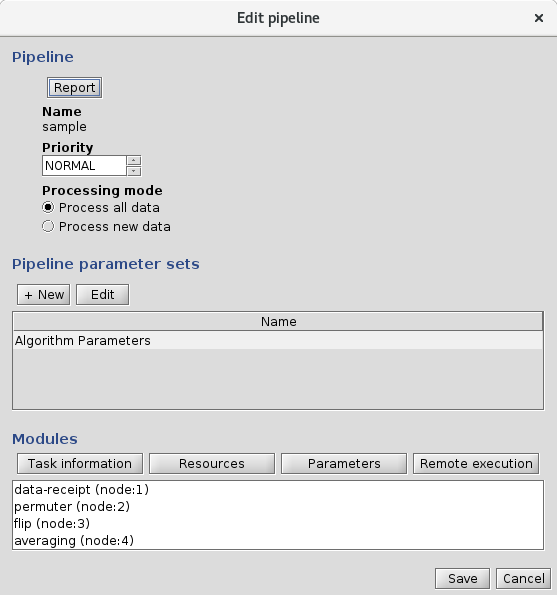
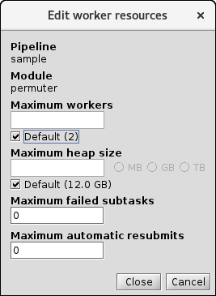
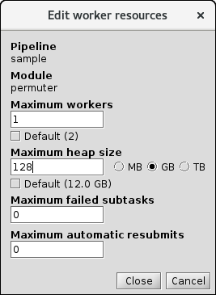

<!-- -*-visual-line-*- -->

[[Previous]](organizing-tables.md)
[[Up]](ziggy-gui.md)
[[Next]](datastore-regexp.md)

## The Edit Pipeline Dialog Box

The Edit Pipeline dialog box is used to edit pipeline parameter sets and modules, and to configure the quantity of resources each pipeline module in a given pipeline can use. 

To get to this dialog box, open the pipelines panel and double-click the pipeline you're interested in. You'll see this:

What does all this stuff do? Let's go through it from the top to the bottom ("Hmm -- I got 'em!'" -C+C Music Factory).

### Pipeline Section

The main actions you can take from this section is to validate the pipeline and view or export parameters.                   

The `Validate` button is a vestige of a bygone era. It looks for issues with the pipeline's parameter sets that are largely impossible today, but which were common in Ziggy's predecessor software packages.

The `Report` button brings up a new window that shows the modules and parameter sets for this pipeline. The report can also be saved to a text file. This dialog is mainly useful in the context of a fairly complex system, in which you want to isolate the bits and pieces of a specified pipeline from the general mass of bits and pieces in the system.

The `Export parameters` button exports the parameters used by this pipeline, in a kind of hokey and non-standard format. The advantage this has over using the export function on the parameter library panel is that it only exports the parameter sets used by this pipeline. In a situation where you have a lot of pipelines, with a lot of parameters, it's potentially useful to be able to see just the parameters for a given pipeline.

The `Priority` field takes a little more explanation. We've discussed in the past the fact that Ziggy sometimes faces a situation in which Ziggy has more tasks waiting for attention than it has worker processes ready to service the tasks. In this case, Ziggy has to prioritize the tasks to ensure that the most critical ones get attention first. The pipeline priority is one way this sorting occurs. Tasks with higher priority get to leap ahead of tasks with lower priority in the queue. The available priorities are LOWEST, LOW, NORMAL, HIGHEST, HIGH. 

So how to tasks get assigned a priority?

All tasks that are running for the first time get assigned a priority equal to the priority of the parent pipeline. In this example, the sample pipeline has a priority of NORMAL, meaning that all tasks for this pipeline will have the a moderate priority level on their first pass through the system. Tasks that are being persisted (which happens on a separate pass through the task management system) do so with priority HIGH, so persisting results takes precedence over starting new tasks. Tasks that are being rerun or restarted do so with priority HIGHEST, which means exactly what it sounds like. 

All pipelines, in turn, are initially created with priority NORMAL, meaning that all pipelines will, by default, produce tasks at priority NORMAL. Thus, all tasks from all pipelines compete for workers with a "level playing field," if you will. Usually this is the situation that most users want.

One case where this isn't true is missions that have occasional need for much faster turnaround of data processing. That is to say, most data can be processed through Pipeline X on a first-come, first-served basis; but occasionally there will be a need to process a small amount of just-acquired data through Pipeline Y immediately. To ensure that this happens, you can set Pipeline Y to have a priority of HIGH or HIGHEST.

Finally, the read-only `Valid?` checkbox is ticked after the `Validate` button is pressed, presuming all went well.  

#### Processing mode

The `Processing mode` radio button section has two options: `Process all data` versus `Process new data`. This option is pretty much exactly what it sounds like. Specifically: the `Process all data` option tells Ziggy that each pipeline module should process all the data it finds, whether that data has already been processed or not; the `Process new data` only processes data files that have never before been processed. For a mission that's currently acquiring data, it's likely that most of the time you'll want to set the `Process new data` option, since it will save time by not processing data that's already been processed. At intervals, the mission may decide to do a uniform reprocessing of all data (to take advantage of algorithm improvements, etc.) For this activity, `Process all data` is the correct option.

### Pipeline Parameter Sets Section

Say that five times fast.

Anyway.

This section shows a list of the parameter sets that are assigned at the pipeline level (that is to say, parameter sets that are made available to every task regardless of which processing module it uses). The `Add` button allows you to select any parameter set in the parameter library and make it a pipeline parameter set for this pipeline. The `Edit` button allows you to change the values of the parameters in a given set. The `Select` and `Auto-assign` buttons do things that used to be useful, but in the current version of Ziggy are not.

Given that the parameter library panel already allows you to view and edit parameters, why is it useful to have this section on this dialog box? Again -- in the case where you have a lot of pipelines and a lot of parameters, it's useful to be able to view the parameters for a given pipeline in isolation. This allows you to avoid confusion about which parameters go to which pipelines.

### Modules Section

The `Modules` section offers functions that address the pipeline modules within a given pipeline.

The display shows the modules in the pipeline, sorted in execution order. You can select a module and press one of the following buttons:

#### Task Information Button

This button produces a table of the tasks that Ziggy will produce for the specified module if you start the pipeline. This takes into account whether the module is configured to process all data or to process only new data; the setting of the taskDirectoryRegex string (which allows the user to specify that only subsets of the datastore should be run through the pipeline). For each task, the task's unit of work description and number of subtasks are shown. If the table is empty, it means that the relevant files in the datastore are missing. The datastore is populated by [Data Receipt](data-receipt.md); that article will help you ingest your data into the datastore so that the task information table can calculate the number of tasks and subtasks the input data will generate.

#### Resources Button

If you look back at [the article on running the cluster](running-pipeline.md), you'll note that we promised that there was a way to set a different limit on the number of workers for each pipeline module. This button is that way! 

More specifically, if you select a module and press the `Resources` button, you'll get the `Edit worker resources` dialog box that displays a number of resource settings:

Let's take these in order, again from top to bottom:

##### Maximum workers

This allows you to set the number of worker processes each pipeline module can spin up. Spinning up more can allow more tasks to run in parallel to one another, but may also cause the tasks to consume more memory than is available. The `Default` check box tells Ziggy to use the default value for the maximum worker processes on this module. The default is the value of the `ziggy.worker.count` property in [the properties file](properties.md), unless you overrode this value by using the `--workerCount` option when you [started the cluster](running-pipeline.md).

##### Maximum heap size

This allows you to set the maximum total Java heap size used by the workers for this pipeline module. As described before, Ziggy will take the maximum heap size for a module and divide it up evenly between the worker processes. Thus, in this case the default of 2 workers and 12 GB heap size means that every worker gets 6 GB of Java heap. As with the `Maximum workers` option, the user can use the `Default` check box to get the default value, or uncheck it to enter a custom value:

As with the worker count, the default heap size is the value specified by the `ziggy.worker.heapSize` property unless it has been overridden by using the `--workerHeapSize` option when you started the cluster. 

##### Maximum failed subtasks

As a pipeline module executes its assorted subtasks, it is possible that not every subtask will run to completion. Most vexingly, it is possible that some of the subtasks will fail due to various errors in the code or features of the data, while others complete successfully. Under ordinary circumstances, if even one subtask fails, the entire task will be marked as failed and the pipeline will halt until the issue is addressed.

The `Maximum failed subtasks` tells Ziggy that, in the event that some subtasks do fail, if the number of subtasks falls below the value of `Maximum failed subtasks`, Ziggy should mark the task as complete rather than failed. Note that this can be set after the fact! Say for example that a task has 100 subtasks, of which 95 succeed and 5 fail. If the mission decides to not try to rescue the 5 failed subtasks right now, you can set `Maximum failed subtasks` to 5 and then resubmit the task. Ziggy will detect that the number of failed subtasks is below the limit and will mark the task as completed. 

##### Maximum automatic resubmits

Another vexing occurrence is when a task, or some of its subtasks, fail even though in principle they should all have been able to complete successfully. This can be due to various transient system problems (a brief glitch in a network file system, for example), or because the task ran out of wall time before all the subtasks had completed. In these cases, it can be useful for Ziggy to automatically resubmit any tasks that fail. By setting the `Maximum automatic resubmits`, you can control this behavior in Ziggy. 

Note that this option can potentially be dangerous. In particular, if a task fails because it has subtasks that fail due to algorithm or data problems, then each time Ziggy resubmits the task those same subtasks will fail again, until the automatic resubmits are exhausted. Use with caution!

#### Parameters Button

This button brings up the `Edit parameter sets` dialog box that displays a table of module-level parameter sets. The user can edit the existing parameter sets, or add a parameter set to a given module. The not-useful `Select` and `Auto-assign` buttons are also present.

#### Remote Execution Button

This button brings up the `Edit remote execution parameters` dialog box. See [the article on the remote execution dialog](remote-dialog.md) for more information.

### Save and Cancel

You're probably thinking, "How much do I really need to know about Save and Cancel buttons?" Well, yeah, they're mostly self-explanatory. But not completely!

To save changes that you've made on the `Edit pipeline` dialog box, or any other dialog box that it spawned, use the `Save` button. To discard all your changes, use the `Cancel` button. 

The points I'm trying to make here are twofold:

1. Anything you do after you launch the `Edit pipeline` dialog box can be discarded, and will only be preserved when you press `Save`.
2. The `Save` and `Cancel` buttons on the `Edit pipeline` dialog box also apply to changes made on the `Edit remote execution parameters` dialog box, the `Edit parameter sets` dialog box, etc.

[[Previous]](organizing-tables.md)
[[Up]](ziggy-gui.md)
[[Next]](datastore-regexp.md)
