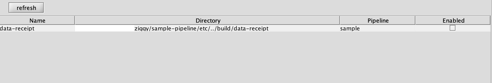
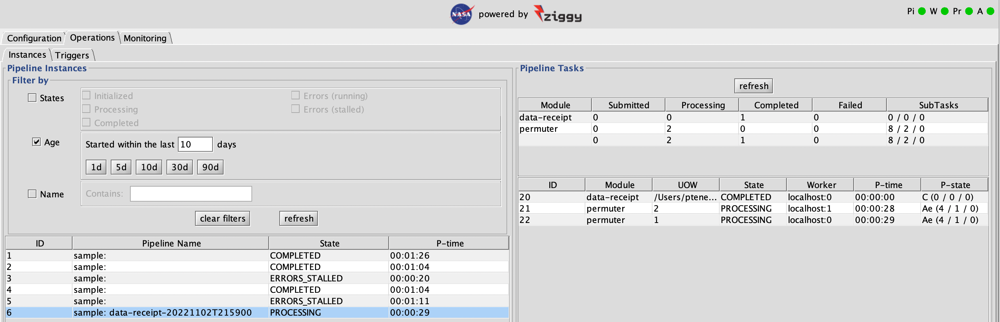
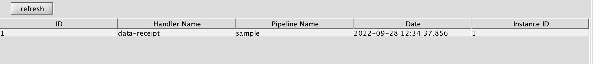
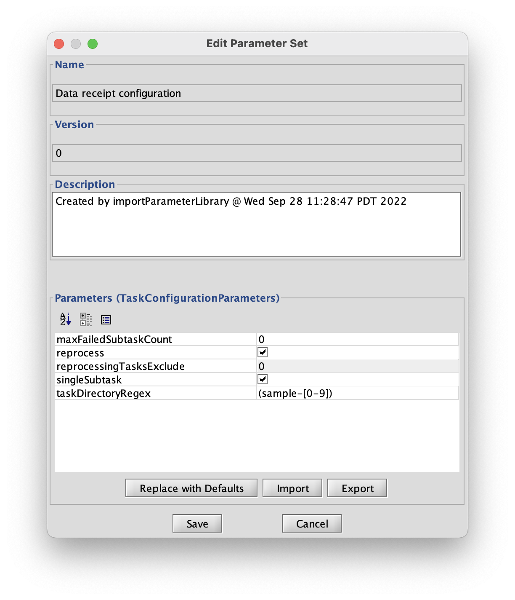
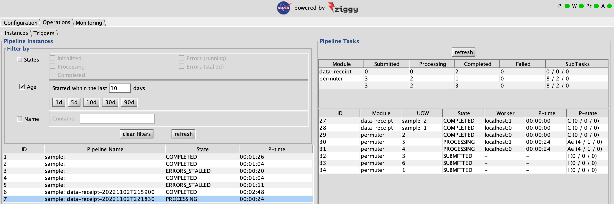

## Event Handler Basics

So far we've talked about Ziggy pipelines as being completely driven by human-in-the-loop control: a pipeline operator is required to launch any pipelines, after which the pipeline runs without further human assistance until it either completes or fails. This is acceptable at the scale of the sample pipeline that ships with Ziggy for demonstration purposes. As the volume of data increases, and more relevantly as the frequency of data deliveries increases, this becomes less desirable. At some data volume it becomes essential for Ziggy to have its own system for determining that some action is required and initiating that action without any help from a human.

Fortunately, Ziggy has this capability in the form of its event handler mechanism.

Note that, for the exercises in this section, I've reset the sample pipeline back to its initial state. The commands for that are as follows:

```
runjava cluster stop
rm -rf sample-pipeline/build
/bin/bash sample-pipeline/build-env.sh
runjava cluster init
runjava cluster start gui &
```

### What it Does

To get a sense of how the event handler works, do the following:

First, get the data receipt directory set up with content. If you followed my suggestion to reset the pipeline back to its initial state, you don't have to do anything further. If you've rejected my suggestion, then you have to copy all the files in `sample-pipeline/data` to `sample-pipeline/build/data-receipt`. As a reminder, the `sample-pipeline/build/data-receipt` directory should look like this when you're done:

```console
data-receipt$ ls -1
nasa_logo-set-1-file-0.png
nasa_logo-set-1-file-1.png
nasa_logo-set-1-file-2.png
nasa_logo-set-1-file-3.png
nasa_logo-set-2-file-0.png
nasa_logo-set-2-file-1.png
nasa_logo-set-2-file-2.png
nasa_logo-set-2-file-3.png
sample-model.txt
sample-pipeline-manifest.xml
data-receipt$
```

Now that you've done that, start the pipeline and the console (if they aren't already running); from the `Configuration` tab select `Event Definitions`.  You'll see a table like this appear:



As shown, an event definition has a name, a directory, a pipeline, and a toggle that enables or disables the event handler. Right now this one is turned off. As you might have inferred from this, when this event handler is turned on, it watches the `sample-pipeline/build/data-receipt` directory for an event; when it sees an event, it starts the `sample` pipeline. At its essence, that's all a Ziggy event handler is: a tool that watches a specified directory and then starts a specified pipeline.

Next step: click the check-box under `Enabled`. Wait for 10-15 seconds, and --

-- nothing happens. The pipeline doesn't start, the `Pi` stoplight doesn't turn green. Nothing.

If you read the preceding paragraphs carefully, you'll see that we left something out. We said that an event handler watches a directory for an event, and it then starts a pipeline. We never defined what constitutes an event! Clearly, it's not just the presence of files in the watched directory: there are files in the watched directory, and the event handler isn't interested.

### What is an Event?

If you think about it, you'll soon realize that it wouldn't be safe for Ziggy to simply start running whenever files show up in the watched directory. For one thing, what would stop Ziggy from starting the pipeline while the files it needs are still being put into the watched directory? For another, what if there are things happening that need to be treated as multiple different events? For another, what if Ziggy needs more information than just, "Go do something"?

To solve these problems, we defined an event signal, known as a ready file, as follows:

**A Ziggy ready file is a zero-length file, where the filename contains all the information Ziggy needs to know how it should respond to the event.**

More specifically, the filename convention for a ready file is as follows:

```
<label>.READY.<name>.<count>
```

The `name` is, well, the name of the event. At any given time there can be ready files with different names in the directory; these correspond to different events. Each different event gets its own pipeline instance.

The `label` provides additional information to the event handler. We'll see how this works shortly. The main thing is that the combination of `name` and `label` need to be unique. If you have outside users doing things that create ready files, make sure that they have name conventions that ensure that this restriction is met!

The `count` indicates how many ready files to expect for a given event `name`. What does this mean? Imagine that somebody, somewhere is generating an event named `tin-machine`, and the following ready files are delivered:

```
hunt.READY.tin-machine.4
tony.READY.tin-machine.4
reeves.READY.tin-machine.4
```

There are 3 ready files for `tin-machine`, but because the `count` portion of the filename is 4, Ziggy knows that it shouldn't start the pipeline yet because there's a fourth ready file needed before the `tin-machine` event is complete and ready to be handled. Once the ready file `david.READY.tin-machine.4` appears, Ziggy knows that it can start the pipeline in response to the `tin-machine` event.

#### Why Have More Than One Ready File?

In the discussion above, we explained how to take a bunch of ready files that have different labels and group them together to represent the same event. We also showed how Ziggy knows how many ready files to expect for a given event, and that Ziggy won't start the pipeline for that event until all the ready files are present.

All of that is fine, but we haven't yet explained why you would want to have more than one ready file per event in the first place! Rather than answer that question immediately, I'm going to beg your indulgence until after we get through the simple example, below, and the more complicated example, even further below.

### What Happens When the Ready File Appears

#### Why Have More Than One Ready File?

In the discussion above, we explained how to take a bunch of ready files that have different labels and group them together to represent the same event. We also showed how Ziggy knows how many ready files to expect for a given event, and that Ziggy won't start the pipeline for that event until all the ready files are present. 

All of that is fine, but we haven't yet explained why you would want to have more than one ready file per event in the first place! Rather than answer that question immediately, I'm going to beg your indulgence until after we get through the simple example, below, and the more complicated example, even further below. 

### What Happens When the Ready File Appears

To see this in action, do the following:

- First, go to the `Event Definitions` panel and turn off the `data-receipt` event handler (i.e., make sure that the check-box is not checked).
- Next, in a terminal window `cd` to the `sample-pipeline/build/data-receipt` directory, and type the following: `touch null.READY.blue-jean.1`. If you list the files in the directory you should see the one you just created, `null.READY.blue-jean.1`.
- Finally, on the `Event Definitions` panel, check the `enabled` box for the `data-receipt` event handler.

After a few seconds, the `Pi` stoplight will turn green. If you now go to the `Instances` tab from the `Operations` tab, you'll see something like this:

TODO Explain the numbers in the UOW column. Ah, I just reminded myself that they might come from the taskDirectoryRegex in the subtask configuration parameters. Might be worth a reminder and cross-reference here (and elsewhere in this article) since it's been a while.



The pipeline is running! The name of the pipeline instance is the pipeline name, plus the name of the event handler that started processing, plus the time at which processing started (in ISO8601 format).

Now to back to the `Configuration` tab, this time choose `Pipeline Events` from the menu on the left:



Every event, from every handler, is shown here.

At this point you'll also see that the `sample-pipeline/build/data-receipt` directory is empty. The data files and model file have been imported, the manifest and its acknowledgement moved to their permanent location, and the ready file has been deleted as well. This prevents a stale ready file from accidentally launching more pipeline instances!

### A More Complicated Example

For the next example, we need to take a couple of steps in preparation.

First, copy the contents of the `multi-data` directory to `data-receipt`:

```console
ziggy$ cp -r sample-pipeline/multi-data/* sample-pipeline/build/pipeline-results/data-receipt
```

Take a look at the resulting contents of data-receipt: there are now 3 subdirectories, each of which has files and a manifest. If you look carefully, you'll see that the `sample-3` directory isn't ready for import: its manifest lists 8 files, but only 7 are present. This simulates a situation in which files are being delivered, the delivery is not complete, and for whatever reason the manifest for `sample-3` arrived before the `sample-3` files for import did. This example will show that parts of a delivery can be processed while other parts are still being delivered.

Next: go to `Configuration`, select `Parameter Library`, and double-click on the `Data receipt configuration` parameter set. Edit the taskDirectoryRegex parameter (TODO Describe how to edit it and what to change it to) and save the parameter set:



Next, edit the `Multiple subtask configuration` and `Single subtask configuration` parameter sets. In both cases, make sure that `reprocess` is unchecked.

Finally, go back to the `Event Definitions` panel and make sure that data-receipt is still `enabled`.

Now! We are ready to start the example. In a terminal window, `cd` to `sample-pipeline/build/pipeline-results/data-receipt`. Enter the following at the terminal window prompt:

```
touch sample-1.READY.glass-spider.2
touch sample-2.READY.glass-spider.2
```

Wait a few seconds, and you'll see something like this:



Ziggy generated two data-receipt tasks: one for sample-1, the other for sample-2 . Once these had run, the pipeline continued, generating and running tasks to process the newly-imported data. The `sample-pipeline/build/data-receipt` now contains only the `sample-3` directory, which was not included in the import. Meanwhile, because there's no new data for `set-1` or `set-2`, we see Ziggy generate tasks for those units of work, but the tasks have no subtasks and so they complete instantly.

TODO Regarding the last sentence about set-*:
1. Add the task IDs associated with set-[12] in parens so that we can identify them.
2. A reminder of the numbers in the UOW column is in order.
3. It might be a good time to remind the reader, notably me, about how the permuter determined its tasks. A naive reader might assume that since the set-1 and set-2 files had already been processed, they wouldn't be processed again, but they kinda sorta were.
4. Ah, I figured it out. The permuter uses the "raw data" type and that regex is applied in the sample subdirectories, right? That also means that UOW is coming from the number in the set-# name, right? But there isn't a grouping for just the number, so a reminder of all this is in order here.
5. Explain or remind how Ziggy determined that there wasn't any new set-[12] data.

What we're simulating here is a situation in which the `sample-1` and `sample-2` data receipt subdirectories were part of one data delivery activity, while `sample-3` is part of another. Once both `sample-1` and `sample-2` were complete, and their ready files delivered, Ziggy knew that those subdirectories were complete, that they were part of a single event, and that there was nothing else in that event that Ziggy needed to wait for, so it could start processing those subdirectories.

If this were happening in real life, once the `sample-3` subdirectory was complete, the system that delivers files to Ziggy could create a new ready file, something like `sample-3.READY.spaceboy.1`, in the data receipt directory. That would signal to Ziggy to start processing the contents of the `sample-3` subdirectory.

From this, we see that there are a couple of reasons to have multiple ready files in a single event:

1. The ready file labels contain information that Ziggy may want or need. For example, data receipt uses the labels to figure out which data receipt subdirectories belong to a single delivery. In order to tell Ziggy that `sample-1` and `sample-2` are 2 subdirectories that are part of the same delivery, we need 2 ready files so that both labels can be supplied.
2. For complicated events, such as data deliveries, the multiple ready files can provide information to the user about the status and progress of the event. For example, by looking at the data receipt directory, the user can tell which directories are ready to be processed and which ones are part of a given event (i.e., you can tell that `sample-3` is not part of the event that contains `sample-1` and `sample-2`, even though the directory names might make you think they're all part of the same event). Alternately, if the user looked and saw subdirectories `sample-1`, `sample-2`, and `sample-3`, but only saw the single ready file `sample-2.READY.blue-jean.2`, they would know that the delivery was ultimately going to contain 2 subdirectories, but that only `sample-2` is complete so far, and that one of the three subdirectories belongs to another, distinct event.

What we're simulating here is a situation in which the `sample-1` and `sample-2` data receipt subdirectories were part of one data delivery activity, while `sample-3` is part of another. Once both `sample-1` and `sample-2` were complete, and their ready files delivered, Ziggy knew that those subdirectories were complete, that they were part of a single event, and that there was nothing else in that event that Ziggy needed to wait for, so it could start processing those subdirectories. 

If this were happening in real life, once the `sample-3` subdirectory was complete, the system that delivers files to Ziggy could create a new ready file, something like `sample-3.READY.spaceboy.1`, in the data receipt directory. That would signal to Ziggy to start processing the contents of the `sample-3` subdirectory. 

From this, we see that there are a couple of reasons to have multiple ready files in a single event:

1. The ready file labels contain information that Ziggy may want or need. For example, data receipt uses the labels to figure out which data receipt subdirectories belong to a single delivery. In order to tell Ziggy that `sample-1` and `sample-2` are 2 subdirectories that are part of the same delivery, we need 2 ready files so that both labels can be supplied. 
2. For complicated events, such as data deliveries, the multiple ready files can provide information to the user about the status and progress of the event. For example, by looking at the data receipt directory, the user can tell which directories are ready to be processed and which ones are part of a given event (i.e., you can tell that `sample-3` is not part of the event that contains `sample-1` and `sample-2`, even though the directory names might make you think they're all part of the same event). Alternately, if the user looked and saw subdirectories `sample-1`, `sample-2`, and `sample-3`, but only saw the single ready file `sample-2.READY.blue-jean.2`, they would know that the delivery was ultimately going to contain 2 subdirectories, but that only `sample-2` is complete so far, and that one of the three subdirectories belongs to another, distinct event. 

### Getting Label Information to Algorithms

Depending on your needs, you may want the pipeline that responds to an event to get information about the event like the event name and labels. This is straightforward.

If you go back to the article on [configuring a pipeline](configuring-pipeline.md), and swim down to the section on "glue" code, you can see that every subtask gets an HDF5 file that includes, among other things, all the module parameters for that subtask. In the `moduleParameters` field, you'll find one named `ZiggyEventLabels` (that is, you'll find it if the pipeline was started by an eent handler; if the pipeline was started manually there won't be any such parameter set). This parameter set will include the name of the event, the name of the pipeline, and all of the event labels that were part of that event when the pipeline launched.

TODO Ah, this sort of answers my question about how labels are used. Suggest an example or two of how the pipeline could use the labels. What makes a good label? Why wouldn't you create a label called sldj? Discussing this up front is likely to drive the next version of this article.

#### The null Label

TODO The next version will discuss use cases. One of those cases will be copying data files directly into the data receipt directory. In this case, the label is not needed, so both it and the following dot can be removed, so that the ready file is READY.scary-monsters.1, for example.

If you go back up to the original example, in which all the files for import were in the main data receipt directory, you might have noticed that the ready file's label was `null`. This is a special case label: it tells Ziggy that there's no actual label information that it's going to need, all it needs is the ready file itself. When Ziggy's event handler infrastructure sees a ready file with a `null` label, it translates that internally into an empty string.

In that particular case, we needed to use `null` because remember that the data receipt event handler, and the data receipt pipeline module, translate the labels into the names of data receipt subdirectories! In that case, since we were using the main directory and not subdirectories, we needed to signal to the event handler and the data receipt pipeline module that we didn't want it looking for subdirectories.

Because ready files need to be unique to the file system, you can't have an event that has two ready files with `null` labels: they would have the same filename, so one would overwrite the other. In general this means that you can only use the `null` label when the event has only 1 ready file associated with it. It's possible to use a `null` label and then other ready files with non-`null` labels, though I have trouble imagining that there would ever be a good reason for that.

As an aside: you may ask, "Why not just leave the label blank in the ready file?" That is, why not a ready file that looks like `.READY.scary-monsters.1`, for example? Unfortunately, a file that starts with a dot is an "invisible" file in both Linux and Mac file systems, which means that it wouldn't show up in a directory listing. We wanted to avoid this outcome (where usually the ready files are visible, but in this case it would not be), thus the `null` label.

### How to Define an Event Handler

There's a whole separate article on [Defining Event Handlers](event-handler-definition.md).
