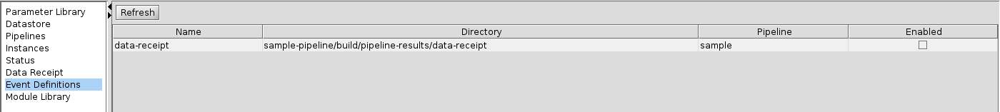
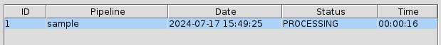
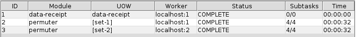
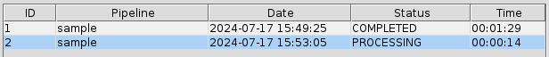
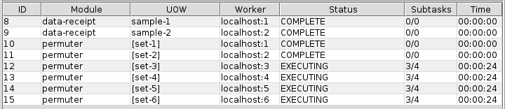

<!-- -*-visual-line-*- -->

[[Previous]](event-handler-definition.md)
[[Up]](event-handler.md)
[[Next]](event-handler-labels.md)

## Event Handler Examples

Now that we've looked at the general concept of event handlers, and we've talked about how to define an event handler, let's work through some examples using the sample pipeline.

Note that for these examples, the sample pipeline has been restored to its original state. That is to say, the `sample-pipeline/build` directory has been deleted, the `sample-pipeline/build-env.sh` script has been executed, and we've used `ziggy cluster init` to set up the cluster (see the articles on [Building a Pipeline](building-pipeline.md) and [Running the Cluster](running-pipeline.md) for more information on these topics). Once that's done, use `ziggy cluster start console &` to start the cluster and bring up a console instance.

### A Simple Example: One Ready File

Right now, the contents of the sample-pipeline/build/pipeline-results/data-receipt directory look like this:

```bash
$ ls -1 sample-pipeline/build/pipeline-results/data-receipt
Listing for: sample-pipeline/build/pipeline-results/data-receipt
nasa_logo-set-1-file-0.png
nasa_logo-set-1-file-1.png
nasa_logo-set-1-file-2.png
nasa_logo-set-1-file-3.png
nasa_logo-set-2-file-0.png
nasa_logo-set-2-file-1.png
nasa_logo-set-2-file-2.png
nasa_logo-set-2-file-3.png
sample-model.txt
sample-pipeline-manifest.xml
$
```

A bunch of data files, a model, and a manifest. Seems like this is a directory that is ready to be imported and run through the sample pipeline!

To make that happen, we need to do two things.

First, we need to turn on the data receipt event handler. To do that, go to the event definitions panel. You'll see this (the directory path here and elsewhere will be fully qualified):



This display is mostly pretty self-explanatory: for each event handler it shows the name, the directory it watches for the ready files, and the pipeline that will be started when the event is detected. The last column tells you whether the event handler is currently watching for events. It's a checkbox, which in this case is not checked, meaning that the event handler isn't watching the data-receipt directory for ready files.

Click on the check box to enable this event handler.

The second thing we need to do is to create the ready file. Before you do that, go to the instances panel so that you can see what happens as it happens. Once you've done that, create the ready file:

```bash
$ touch sample-pipeline/build/pipeline-results/data-receipt/READY.test1.1
$
```

Once you do this, the Pi light on the console will quickly turn green. After a few seconds, you'll see a new pipeline instance appear in the instances panel:



The event handler automatically names the pipeline with the "bare" pipeline name ("sample"), the event handler name ("data-receipt"), and the timestamp of the event that started the processing. The Event name column shows the name of the event handler as well ("data-receipt"). Note that the Event name column is initially hidden as it duplicates the information in the pipeline name. If you want to sort the table by the event handler name, use the context menu in the table header to enable to Event name column. Then you can click in the header to update the sort. Meanwhile, the tasks table looks like this:



The data receipt task ran to completion before the display could even update, and the pipeline went on to its `permuter` tasks. After the usual few seconds, the pipeline will finish, with `flip` and `averaging` tasks.

### A More Involved Example: Multiple Deliveries, Multiple Directories

For the next trick, the first step is to copy the contents of the `multi-data` directory into `data-receipt`:

```bash
$ cp -r sample-pipeline/multi-data/* sample-pipeline/build/pipeline-results/data-receipt
$
```

The data receipt directory looks like this:

```
$ ls -1 sample-pipeline/build/pipeline-results/data-receipt/
Listing for: sample-pipeline/build/pipeline-results/data-receipt/
sample-1
sample-2
sample-3
$
```

You can confirm for yourself that `sample-1`, `sample-2`, and `sample-3` are directories, each of which contains data files and a manifest. In this case, we've made things more complicated than the initial example, to wit: each of the sample directories contains 2 sets of data (`set-3` and `set-4` in `sample-1`, `set-5` and `set-6` in `sample-2`, and `set-7` and `set-8` in `sample-3`. )

For this example, we're going to simulate the following situation:

Two different sources are pushing data into the data-receipt directory. The first source is responsible for `sample-1` and `sample-2`; the other is responsible for `sample-3`. At some point, the first source has finished its deliveries but the second has not. This is the point at which the example will start.

Before we do that, though, let's reconfigure the pipeline a bit. Specifically, let's tell the pipeline that we only want it to process new data that's never been processed, and it should leave alone any data that's been successfully processed before this. To do so, select the `Multiple subtask configuration` and the `Single subtask configuration` parameter sets, and uncheck the reprocess box:


Now return to the instances panel, and finally create the ready files. Remember that you need two ready files because we are simulating a complete delivery from the first source, and it's delivering to the `sample-1` and `sample-2` directories.

```bash
$ touch sample-pipeline/build/pipeline-results/data-receipt/sample-1.READY.test2.2
$ touch sample-pipeline/build/pipeline-results/data-receipt/sample-2.READY.test2.2
$
```

As soon as the second ready file is created, a new pipeline instance will start:



The tasks display will look like this:



There's a fair amount of interesting stuff going on here, so let's dig into this display!

#### Data Receipt Tasks

There are two data receipt tasks, `sample-1` and `sample-2`. These are the tasks that ran against the `sample-1` and `sample-2` subdirectories, respectively, of the main data receipt directory. As we expected and advertised, by giving the ready files labels of `sample-1` and `sample-2`, we were able to get Ziggy to import from those directories while leaving the `sample-3` directory alone.

#### Permuter Tasks for UOWs 3, 4, 5, and 6

The two directories that were imported by data receipt contained a total of 4 data sets: `set-3`, `set-4`, `set-5`, and `set-6`. These ran with task IDs 12, 13, 14, and 15. As a general matter, when Ziggy needs to make multiple tasks for a given pipeline module, it creates them in no particular order, so you can wind up with situations where the units of work do not appear in order.

If you have more tasks than workers, you will see that some tasks will get as far as `WAITING_TO_STORE` (see the article on the [Instances Panel](instances-panel.md) for more information). At that point, we would expect those tasks to store outputs and then go to the final processing step `COMPLETE`. Instead, those tasks will wait in the `WAITING_TO_STORE` step while other tasks execute their algorithms. Why is that?

This means that the supervisor has a finite number of workers that can be used for assorted task processing activities. That creates a problem: there are fewer workers than tasks that need to run, and each task needs to perform several steps (marshaling, algorithm execution, storing results). Ziggy needs to prioritize users of its limited number of worker threads, and it does so by putting algorithm execution at a higher priority than storing results. Thus, we can wind up with tasks that have produced results, but they're waiting for workers to store those results; and the workers won't be available for this purpose until all the tasks have completed algorithm execution.

Take a quick look at the properties file, `sample-pipeline/etc/sample.properties`, to see how many workers are provided by the sample pipeline:

```
ziggy.worker.count = 6
```

(See the article on [Properties](properties.md) to refresh your memory on this).

#### Permuter Task for UOW 2

Meanwhile, before any of the `sample-1` or `sample-2` data sets got processed, we see two tasks with ID 10 and 11, permuter module, running on data sets 1 and 2. Oddly, the subtask "scoreboards" are `0/0`. What happened?!?!

Well -- remember that we set up this example so that it wouldn't process any data that got processed before (i.e., we are doing "keep-up" processing, not reprocessing). All of the data in `set-1` and `set-2` was processed in the first example, so there were no `set-1` or `set-2` subtasks that needed to be processed in this example.

Okay, but in that case, why did Ziggy create tasks for `set-1` and `set-2` processing? Well, the situation is this:

Ziggy's order of operations is that it has to first create its tasks, and only then can it go and figure out how many subtasks need to be processed in each task. Ziggy found that its datastore held a total of 6 units of work for permuter, went ahead and created one task for each unit of work, and only then realized that two of the tasks had no subtasks that needed processing! Once it's gotten that far, it lets the zero-subtask tasks run through the system. This prevents some potential user confusion ("Hey, why did Ziggy go from task 9 to task 12? Where are tasks 10 and 11?" "Why aren't there tasks for set 1 and set 2?"). It also avoids some other problems too boring to get into here.

#### Meanwhile, Back in the Data Receipt Directory...

If we look at the contents of the data receipt directory, this is what we see:

```bash
$ ls -1 sample-pipeline/build/pipeline-results/data-receipt/
Listing for: sample-pipeline/build/pipeline-results/data-receipt/
sample-3
$
```

The sample-1 and sample-2 directories are gone. The ready files for sample-1 and sample-2 are gone. All that's left is the sample-3 directory. This is exactly what we'd hoped (and asserted) would happen: Ziggy was able to figure out which of the deliveries were complete, and process them, while leaving the incomplete delivery alone.

#### Finally...

If you keep watching the console, you'll see that once the permuter tasks are done, Ziggy will create flip tasks for all 6 datasets, then averaging tasks for all 6. The tasks for `set-1` and `set-2` will always have zero subtasks to process and will complete instantly; the other tasks will take a finite time to process their subtasks.

To review the files that were ingested, refer to the [Data Receipt Display](data-receipt-display.md) article.

[[Previous]](event-handler-definition.md)
[[Up]](event-handler.md)
[[Next]](event-handler-labels.md)
