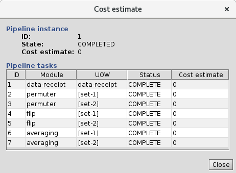

<!-- -*-visual-line-*- -->

[[Previous]](remote-dialog.md)
[[Up]](select-hpc.md)
[[Next]](data-receipt.md)

## HPC Cost Estimation

The Remote Parameters Dialog allows you to get a prior estimate of the cost of processing a task on HPC. This is great, but a post-run estimate is also valuable. The post-run can differ from the pre-run for two reasons: First, the pre-run estimate might have been an overestimate, in which case the jobs would finish ahead of schedule and the true cost would be lower; alternately, if the jobs all ran out of wall time and the task was resubmitted, then the total cost will be higher than the pre-run estimate.

Ziggy keeps a running track of the costs of all jobs associated with a task and can display them for the user. Note that even after the tasks have finished, the costs are considered estimates. This is because they don't actually tap into any job accounting system at the HPC facility, which would provide a definitive cost (i.e., what you were actually charged). Instead, Ziggy computes the cost by considering the execution time of each job and its node type. Since this isn't the definitive value, we always call it an estimate.

Anyway:

### Viewing the HPC Cost Estimates

Go to the instances panel, right-click on an instance, and run the Estimate cost command. You'll get a new dialog box:

In our case, we ran all our tasks on the local system so all the estimates are zero! However: if you'd run on an HPC system, the `Cost estimate` column would show the running total for each task during execution, and would show a final estimate after execution completed.

[[Previous]](remote-dialog.md)
[[Up]](select-hpc.md)
[[Next]](data-receipt.md)
