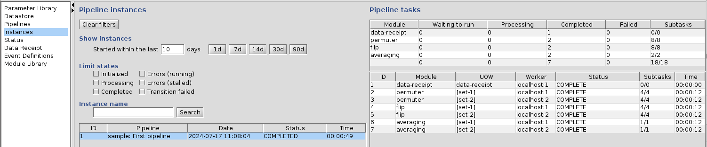

<!-- -*-visual-line-*- -->

[[Previous]](start-pipeline.md)
[[Up]](ziggy-gui.md)
[[Next]](start-end-nodes.md)

## The Instances Panel

The instances panel is the single most useful part of Ziggy when it comes to monitoring execution, so it's worth some discussion of exactly what it's trying to tell you. In the process, we'll introduce some concepts that will remain vital as we move through Ziggy-land.

### Instances, Tasks, and Subtasks

The first thing to explain is the concept of instances, tasks, and subtasks. Instances are the things shown on the left side of the display; tasks are on the right; the numbers in the last column of the tasks table represent counts of subtasks.

And now you know as much as you did when we started. Okay, keep reading.

#### Instances

A pipeline instance is just what it sounds like: it's a single instance of one of the pipelines defined in the `pd-*.xml` files. Recall that the sample pipeline has 4 nodes: data receipt, permuter, flip, and averaging. When you pressed the `Start` button, Ziggy created a copy of that pipeline, in a form that Ziggy knows how to execute.

Each instance has a unique ID number, with instance 1 being the first (so 1-based, not 0-based). The instance contains its own copies of all the parameter sets used in the pipeline, and these are stored permanently. Thus, even if you later change the values of some parameters, the copies that were made for the instance won't change.

#### Tasks

A pipeline task is also just what it sounds like: it's a chunk of work that Ziggy has to execute as part of a pipeline instance. Each task uses a specific algorithm module to process a specific collection of data. Tasks, then, are the things that pipeline instances use to run the individual algorithms. Every task is associated with one and only one instance; an instance can have as many tasks as it needs to get the work done.

In the same way that a pipeline instance is defined by a `pipeline` definition in one of the `pd-*.xml` files, each task is created from a `node` in the pipeline. As the pipeline instance executes, it steps through the node list; at each node, it creates tasks that run the algorithm defined by the node; once those tasks are done, the instance moves on to the next node until the tasks created from the last node finish.

Like pipeline instances, pipeline tasks have unique ID numbers that start at 1 and increase monotonically. Task numbers are never "recycled." That is to say, if pipeline instance 1 has tasks 1 through 7, pipeline instance 2 will start with task 8.

#### Subtasks

It turns out that, in many (perhaps most) cases, data analysis is what we call "embarrassingly parallel:" that is to say, there are a lot of nuggets of processing that can be performed in parallel with one another, that do not need to interact with each other at any time, and which run the same code against different chunks of data. In cases like this, there's a big execution time advantage if the nuggets are run simultaneously with one another to the extent that the compute hardware will allow.

These nuggets are known in Ziggy-land as subtasks.

Subtasks, confusingly, are numbered from zero. Also, subtask numbers are "recycled:" that is to say, if one task has subtasks 0 to N, another will have subtasks 0 to M. The subtask numbers appear in the subdirectories of the task directory as `st-0` through `st-<whatever>`.

With all that in mind, let's look at the instances panel again:



The instance on the left, instance 1, is the pipeline instance that's going to plow through the entire pipeline, from data receipt to averaging. On the right, we see the tasks that instance 1 uses for the processing: one task for data receipt, two each for permuter, flip, and averaging. The numbers in the `P-state` column represent subtask counts: the first number is total number of subtasks, the second is number completed, the third is number failed. Each of permuter and flip used 4 subtasks per task; averaging ran with just 1 subtask per task.

The scoreboard at the top rolls up the tasks table according to algorithm name. The permuter line shows the aggregated results of the 2 permuter tasks, and so on. The final line is the roll-up across all tasks within the pipeline. The scoreboard presents the task information slightly differently in that it shows totals of `Submitted`, `Processing`, `Completed`, and `Failed`. `Completed` and `Failed` are self-explanatory (I hope). `Processing` indicates tasks that are currently using computer time to process their data. `Submitted` tasks are tasks that are waiting for some hardware, somewhere, to decide to process them. Depending on your system, tasks may go instantly from `Submitted` to `Processing`, or some of them might have to wait around awhile in the `Submitted` queue.

### Unit of Work

In the midst of all this is a column under tasks labeled `UOW`, which stands for "Unit of Work." As a general matter, "Unit of Work" is a $10 word for, "What's the chunk of data that this task is in charge of?"

The parameter set that Ziggy uses to figure out how to divide work up into tasks also provides a means by which the user can specify a name that gets associated with each task. This is what's displayed in the `UOW` column. In the event that some tasks for a given algorithm module succeed and others fail, the `UOW` label lets you figure out where Ziggy got the data that caused the failed task. This can be useful, as I'm sure you can imagine.

#### Can You be a Bit More Specific About That?

Sure! Let's take a look again at the input data file type for permuter:

```xml
  <dataFileType name="raw data" location="dataset/L0"
                fileNameRegexp="(nasa-logo-file-[0-9])\.png"/>
```

While we're at it, let's look at the definition of the `dataset` datastore node:

```xml
   <datastoreRegexp name="dataset" value="set-[0-9]"/>
   <datastoreNode name="dataset" isRegexp="true" nodes="L0, L1, L2A, L2B, L3">
```

When Ziggy goes to generate `permuter` tasks, the first thing it does is go to the datastore and say, "Give me all the directories that match the location of this `raw data` data file type." When it gets back "`set-1/L0`" and "`set-2/L0`", it says to them, "Congratulations, you two define the two units of work for this module."

The next thing Ziggy has to do is give those tasks names, or in Ziggy lingo, "brief states." The way it does that is by grabbing the `set-1/L0` location and the `set-2/L0` location and asking, "What parts of these locations are different from one to the next?" Seeing that it's the "set-#" part, it then says, "Congratulations, your brief states are `[set-1]` and `[set-2]`."

##### A More Complicated Example

Now let's imagine a less trivial datastore configuration:

```xml
<datastoreRegexp name="guitar" value="(reeves|carlos|mick)"/>
<datastoreRegexp name="drums" value="(omar|woody|hunt)"/>
<datastoreRegexp name="album" value="(earthling|outside|stardust|hours)"/>

<datastoreNode name="guitar" isRegexp="true" nodes="drums">
  <datastoreNode name="drums" isRegexp="true" nodes="singer"/>
	<datastoreNode name="spider" nodes="album"/>
  <datastoreNode name="albums" isRegexp="true"/>
</datastoreNode>

<dataFileType name="preposterous" location="guitar/drums/spider/albums"
              fileNameRegexp="david-bowie-[0-9]+\.h5"/>
```

When Ziggy goes to make units of work, and then tasks, there will be 36 of them total! The brief states will be things like, "`[reeves;omar;earthling]`", "`[reeves;woody;earthling]`", "`[carlos;woody;hours]`", etc. In other words, 1 task for each possible combination of `guitar`, `drums`, and `album`.

Notice that, although all the data directories have a `spider` element in the path, none of the brief states include `spider`. This is because it's common to all the tasks, which means it's not interesting to put into the brief state. The brief state only includes the path elements that vary between tasks.

##### But What if I Don't Want to Run All 36 Tasks?

So in our real sample pipeline, what do you do if you only want to run the `set-1` tasks? Or, in our more complicated example, what if we want to run the tasks where guitar is set to `reeves` and album is set to either `outside` or `stardust`?

It can be done! But not here. If you want to know how this is handled, check out [the article on the Datastore Regular Expression control panel](datastore-regexp.md).

#### What About Subtask Definition?

Now we've seen how Ziggy uses the inputs data file type to define multiple tasks for a given pipeline node. How do subtasks get defined?

The default is for Ziggy to create a subtask for each input data file. When creating a task, Ziggy finds all of the data files in the appropriate datastore directory: in the case of `permuter`, `raw-data`, and `set-1/L0`, we find `nasa-logo-file-0.png`, `nasa-logo-file-1.png`, `nasa-logo-file-2.png,` `nasa-logo-file-3.png`. Ziggy goes ahead and creates a subtask for each of these data files. Presto! Four subtasks for `permuter`.

##### Tasks with Multiple Input Data File Types

At the end of the pipeline, we have the `averaging` pipeline module, which averages together a bunch of PNG files. Let's see how it's defined in pd-sample.xml:

```xml
    <node moduleName="averaging" singleSubtask="true">
      <inputDataFileType name="left-right flipped"/>
      <inputDataFileType name="up-down flipped"/>
      <outputDataFileType name="averaged image"/>
    </node>
```

This module has two input file types! How does Ziggy generate subtasks for that?

Let's look again at the `left-right flipped` and `up-down flipped` data file type definitions:

```xml
  <!-- Results from processing step 2A (LR flip) -->
  <dataFileType name="left-right flipped" location="dataset/L2A"
                fileNameRegexp="(nasa-logo-file-[0-9])\.fliplr\.png"/>

  <!-- Results from processing step 2B (UD flip). -->
  <dataFileType name="up-down flipped" location="dataset/L2B"
                fileNameRegexp="(nasa-logo-file-[0-9])\.flipud\.png"/>
```

Notice the part of the fileNameRegexp that's inside the parentheses: In Java regular expressions, this is called a "group." Java has tools that will take a string, match it to a regular expression, and extract the values of the groups for futher perusal. 

You've probably already guessed what this is leading up to:

**When Ziggy has multiple input data file types for a pipeline module, it figures out which files go together in a subtask by their regular expression groups. Specifically, two files go together if the values of all their regular expression groups match.** 

Of course, if that was the only requirement, we could simply give both data file types the fileNameRegexp value of `(nasa-logo-file-[0-9])\.png`. There is one other requirement, which, again, you've probably already guessed:

Because all of the inputs for a given subtask get copied to the subtask working directory, they must all have unique names. If we used `(nasa-logo-file-[0-9])\.png`for both fileNameRegexp values, then either the up-down flipped file would overwrite the left-right flipped one, or vice versa.

In fact, the rule is stricter than that, because output files get written into the subtask working directory as well, and, again, we can't abide by files overwriting each other. Thus the general rule:

**All of the inputs and outputs files for a pipeline module must have unique names. Inputs files for a given pipeline module must have names that match up to the first period (".") character.**

##### Tasks with Only One Subtask

There are also cases in which you won't want Ziggy to automatically build a bunch of subtasks. Consider the `averaging` pipeline module: we want to average together all 4 of the up-down flipped and all 4 of the right-left flipped images into one final averaged image. We obviously can't do that if `averaging` creates 4 subtasks and each one averages together one up-down flipped file with one left-right flipped one. In this situation -- where Ziggy is tempted to make multiple subtasks but you want it to resist that temptation -- you can tell this to Ziggy by adding the `singleSubtask="true"` attribute to the pipeline node definition. If you look back up at the definition of the `averaging` node a few paragraphs back, you can see that the node is marked to produce a single subtask, and indeed that's exactly what it does.

##### Data Files Needed By All Subtasks

Now let's consider an even more complex situation: imagine that the `permuter` pipeline module needs some other flavor of data file that's in the datastore. Let's imagine that there's a directory, description, that's at the same level of the datastore as the L0, etc., directories, and it contains a bunch of files with miscellaneous names and file type XML:

```xml
  <!-- Datastore regular expressions. -->
  <datastoreRegexp name="dataset" value="set-[0-9]"/>

  <!-- Datastore node definitions. -->
  <datastoreNode name="dataset" isRegexp="true" nodes="description, L0, L1, L2A, L2B, L3">
    <datastoreNode name="description"/>
    <datastoreNode name="L0"/>
    <datastoreNode name="L1"/>
    <!-- etc. -->
  </datastoreNode>

  <dataFileType name="description" location="dataset/description"
                fileNameRegexp="*.XML"/>
```

Imagine that permuter needs the files from description to do its work; but, unlike in the case of the PNG files, every subtask needs every description file. That is, the `set-1` subtask `st-0` needs one file from the `set-1/L0` directory and all of the files in `set-1/description`; the st-1 subtask needs a different file from `set-1/L0`, but it also needs all of the files in `set-1/description`; and so on. What do we do?

There's an XML attribute (of course) that tells Ziggy to resist the temptation to slice up the files for a data file type into different subtasks. It's the `includeAllFilesInAllSubtasks` attribute, which is applied to the data file type definition:

```xml
  <dataFileType name="description" location="dataset/description" 
                fileNameRegexp="*.XML" includeAllFilesInAllSubtasks="true"/>
```

The node definition above tells Ziggy that it should form subtasks using files of the `raw data` type, but then give every subtask copies of all of the files of the `description` type.

##### What If I Need a Data File Type That's Sometimes `includeAllFilesInAllSubtasks`, and Sometimes Not?

In that case, what you do is define ... two data file types. They need to have different `name`s and values of the `includeAllFilesInAllSubtasks` attribute, but matching `location` and `fileNameRegexp` attributes:

```xml
  <dataFileType name="description" location="dataset/description"
                fileNameRegexp="*.XML" includeAllFilesInAllSubtasks="true"/>
  <dataFileType name="description-one-per-subtask" location="dataset/description"
                fileNameRegexp="*.XML"/>
```

Note that we're taking advantage of the fact that `includeAllFilesInAllSubtasks` is an optional attribute that defaults to `false`.

At this point you're probably thoroughly sick of the entire topic of subtasks, so let's go back to the console.

### Pipeline States

The instances panel also has numerous indicators named `State` and `p-State` that deserve some explanation.

#### Pipeline Instance States

The possible states for a pipeline instance are described below.

| State          | Description |
| -----          | ----------- |
| INITIALIZED    | Instance has been created but Ziggy hasn't yet gotten around to running any of its tasks. |
| PROCESSING     | Tasks in this instance are being processed, and none have failed yet. |
| ERRORS_RUNNING | Tasks in this instance are being processed, but at least 1 has failed. |
| ERRORS_STALLED | Processing has stopped because of task failures. |
| STOPPED        | Not currently used. |
| COMPLETED      | All done! |

About ERRORS_RUNNING and ERRORS_STALLED: as a general matter, tasks that are running the same algorithm in parallel are totally independent, so if one fails the others can keep running; this is the ERRORS_RUNNING state. However: once all tasks for a given algorithm are done, if one or more has failed, it's not guaranteed that the next algorithm can run. After all, a classic pipeline has the outputs from one task become the inputs of the next, and in this case some of the outputs from some of the tasks aren't there. In this case, the instance goes to ERRORS_STALLED, and nothing more will happen until the operator addresses whatever caused the failure.

#### Pipeline Task States

The possible states for a pipeline task are described below.

| State       | Description |
| -----       | ----------- |
| INITIALIZED | Task has been created and is waiting for some kind of attention.|
| SUBMITTED   | The task will run as soon as the supervisor has available resources to devote to it.|
| PROCESSING  | The task is running. |
| ERROR       | All subtasks have run, and at least one subtask has failed. |
| COMPLETED   | All subtasks completed successfully and results were copied back to the datastore. |
| PARTIAL     | Not currently used. |                                        |

#### Pipeline Task Processing States (p-States)

When a task is in the `PROCESSING` state, it's useful to have a more fine-grained sense of what it's doing, where it is in the process, etc. This is the role of the processing state, or `P-state`, of the task. Each `P-state` has an abbreviation that's shown in the last column of the tasks table. The `P-states` are shown below.

| P-state              | Abbreviation | Description |
| -------              | ------------ | ----------- |
| INITIALIZING         | I            | Nothing has happened yet, the task is still in the state it was in at creation time. |
| MARSHALING           | M            | The inputs for the task are being assembled. |
| ALGORITHM_SUBMITTING | As           | The task is ready to run and is being sent to whatever system is in charge of scheduling its execution. |
| ALGORITHM_QUEUED     | Aq           | In the case of execution environments that use a batch system, the task is waiting in the batch queue to run. |
| ALGORITHM_EXECUTING  | Ae           | The algorithm is running, data is getting processed. |
| ALGORITHM_COMPLETE   | Ac           | The algorithm is done running. |
| STORING              | S            | Ziggy is storing results in the datastore. Sometimes referred to as "persisting." |
| COMPLETE             | C            | The results have been copied back to the datastore. |

### Worker

The `Worker` column on the tasks table shows which worker is managing task execution.

Right now, the workers all run on the same system as the supervisor, which is also the same system that runs the console. As a result, all the workers are "localhost" workers. At some point this may change, and the supervisor, workers, and console can conceivably run on different systems. For this reason we've left the "localhost" part of the display, in an effort to future-proof it.

Recall from the discussion on [Running the Cluster](running-pipeline.md) that the supervisor can create multiple worker processes that can execute in parallel. The worker number tells you which of these is occupied with a given task.

### P-Time

Both the instances table and the tasks table have a column labeled `P-time`. This represents the total "wall time" the instance or task has been running. Put simply, `P-time` is a timer or stopwatch that starts when the task or instance starts running, stops when the instance or task completes or fails, and starts again if the task or instance restarts. It's thus the total-to-date time spent processing, including any time spent in execution attempts that failed.

[[Previous]](start-pipeline.md)
[[Up]](ziggy-gui.md)
[[Next]](start-end-nodes.md)
