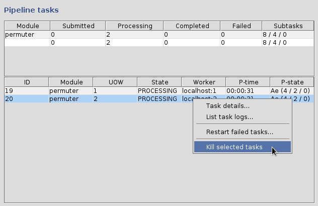
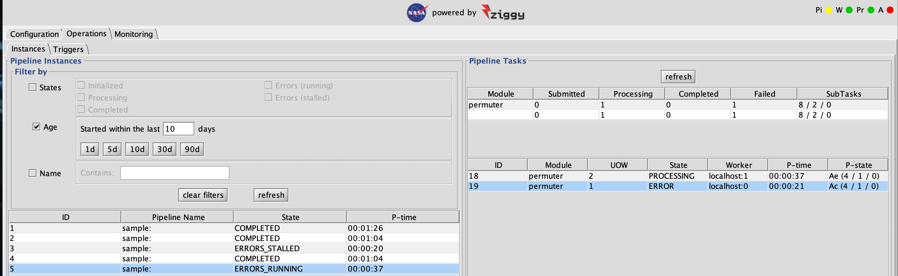
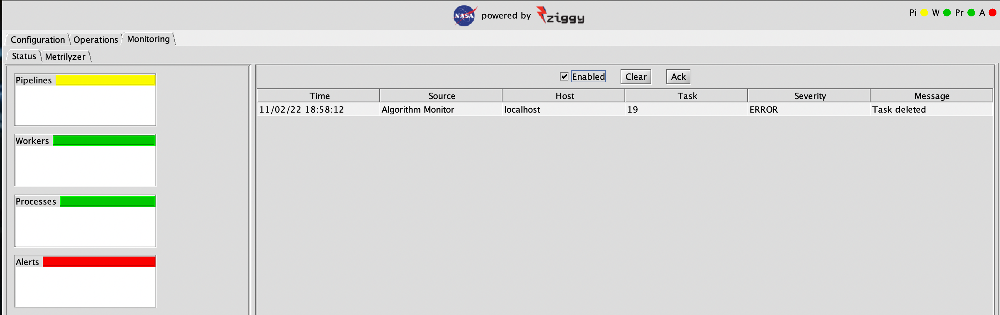

<!-- -*-visual-line-*- -->

[[Previous]](rerun-task.md)
[[Up]](ziggy-gui-troubleshooting.md)
[[Next]](select-hpc.md)

## Killing Tasks

Sometimes it's necessary to stop the execution of tasks after they start running. Tasks that are running as jobs under control of a batch system at an HPC facility will provide command line tools for this, but they're a hassle to use when you're trying to kill a large number of jobs. Trying to kill tasks running locally is likewise hassle-tastic.

Fortunately, Ziggy will let you do this from the console.

### Kill all Jobs for a Task

To kill all jobs for a task, go to the tasks table on the instances panel, right click the task, and run the `Kill selected tasks` command:

You'll be prompted to confirm that you want to kill the task. When you do that, you'll see something like this:

The state of the task will be immediately moved to `ERROR`, P-state `ALGORITHM_COMPLETE`. The instance will go to state `ERRORS_RUNNING` because the other task is still running; once it completes, the instance will go to `ERRORS_STALLED`. Meanwhile, the alert looks like this:

As expected, it notifies you that the task stopped because it was killed and not due to an error of some kind.

### Kill all Tasks for an Instance

This is the same idea, except it's the pop-up menu for the instance table, and you select `Kill all incomplete tasks`.

[[Previous]](rerun-task.md)
[[Up]](ziggy-gui-troubleshooting.md)
[[Next]](select-hpc.md)
