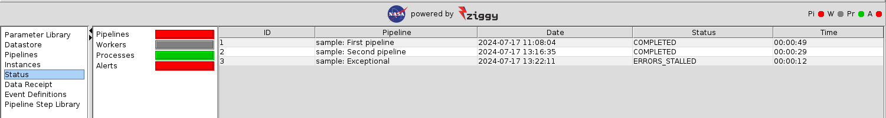

<a href="ziggy-gui-troubleshooting.md">[Previous]</a> <a href="ziggy-gui-troubleshooting.md">[Up]</a> <a href="alerts.md">[Next]</a>

## Monitoring Tab

When stuff goes wrong, it's often worthwhile to click over to the `Monitoring` tab. In the current situation, you'll see something like this:

The first thing you should notice is that the colored boxes on the left mirror the colors of the stoplights. From this you can see that the stoplights are for pipelines (`Pi`), workers (`W`), Processes (`Pr`), and alerts (`A`).

The next thing you'll notice is that if you click on the titles of the boxes on the left, the content of the panel on the right changes. This allows you to see the state of assorted Ziggy components.

### Pipelines Status

The `Pipelines` box, when clicked, just takes you back to the `Operations` tab. There's no better set of information for the status of running / completed pipelines than that.

### Workers Status

The view shown above is the `Workers` status panel. This shows what each of the worker's processing threads is doing. The colored box and the stoplight are grey, which indicate that all the workers are currently idle. When stuff's happening, the box and stoplight turn green, and the table on the worker status panel shows what each thread is doing.

### Processes Status

The `Processes` status panel looks like this:

The panel shows the current status and helpful parameters for three processes: the worker, the database, and the messaging system. Ziggy's messaging system is Java's Remote Method Invocation (RMI). RMI is actually in the family of Remote Procedure Calls (RPCs), which are a way that one process can request that another process execute a method, function, procedure, or other program unit. In this case, RMI allows the worker (a Java program) and the console (another Java program) to communicate with one another.

In our experience, it's really unusual for any of these processes to fail, but if they do then the colored bar for that process will change to yellow or red. In that case, the best place to look for further clues is the worker log.

### Alerts Status

Alerts are somewhat more informative for most problems, so alerts have [their own article](alerts.md).

### Colors

The colors on the left-hand panel match the colors of the stoplights at the top-right of the console. Each of the 4 subsystems (pipelines, workers, processes, alerts) can be one of: grey, green, yellow, red. Here's the decoder ring for the colors:

|           | Grey                | Green                 | Yellow                                               | Red                                                    |
| --------- | ------------------- | --------------------- | ---------------------------------------------------- | ------------------------------------------------------ |
| Pipelines | No pipeline running | Pipeline(s) running   | Pipeline in `ERRORS_RUNNING` state                   | Pipeline in `ERRORS_STALLED` state                     |
| Workers   | All workers idle    | Worker(s) active      | Not used                                             | Not used                                               |
| Processes | Not used            | All processes healthy | Process(es) in a failed state, attempting to recover | Process(es) in a failed state, recovery efforts failed |
| Alerts    | Not used            | No new alerts         | New warning level alert(s)                           | New error-level alert(s)                               |

<a href="ziggy-gui-troubleshooting.md">[Previous]</a> <a href="ziggy-gui-troubleshooting.md">[Up]</a> <a href="alerts.md">[Next]</a>
