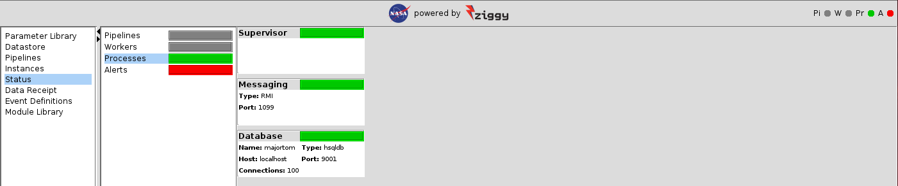

<!-- -*-visual-line-*- -->

[[Previous]](ziggy-gui-troubleshooting.md)
[[Up]](ziggy-gui-troubleshooting.md)
[[Next]](alerts.md)

## Status Panel

When stuff goes wrong, it's often worthwhile to select the `Status` content menu item. In the current situation, you'll see something like this:

The first thing you should notice is that the colored boxes in the content menu for the status panel mirror the colors of the stoplights. From this you can see that the stoplights are for pipelines (`Pi`), workers (`W`), Processes (`Pr`), and alerts (`A`).

The next thing you'll notice is that if you select one of the content menu items in the status panel, the content of the panel on the right changes. This allows you to see the state of assorted Ziggy components.

### Pipelines Status

The `Pipelines` status panel displays all of the pipelines that have ever run.

### Workers Status

The view shown above is the `Workers` status panel. This shows what each of the workers is doing. The colored box and the stoplight are grey, which indicate that at the moment there are no workers. When stuff's happening, the box and stoplight turn green, and the table on the worker status panel shows what each worker is doing.

Why are there no workers? 

Workers are created as needed, and each worker is assigned to perform a particular pipeline task (or a portion of a particular task). Once the worker's job is done, the worker is closed down, and if the supervisor later needs a worker process, it will create one on-the-fly. Thus when you run a pipeline that has a total of 6 tasks, and has a worker count of 2, the supervisor will create a total of 6 workers over the course of execution, but only 2 will be running at any given time.

Thus the blank workers display: when there are no tasks running, there are no workers running; and when a worker isn't running, it ceases to exist. If you were to start the sample pipeline with the default maximum number of workers set to 6, after the delay mentioned in the first point you'd see that only 2 workers would be started to process the two tasks.

Most of this table is (hopefully) self-explanatory. The thing that might not be is the content of the first column. This shows the worker ID for a given task (which you've seen before on the operations monitoring panel); the host ID (ditto); and the worker's process ID. The process ID is useful if you want to use one of your system's utilities (such as the `ps` or `top` commands) to get more information on what that worker is doing.

### Processes Status

The `Processes` status panel looks like this:

The panel shows the current status and helpful parameters for three processes: the supervisor, the database, and the messaging system. Ziggy's messaging system is Java's Remote Method Invocation (RMI). RMI is actually in the family of Remote Procedure Calls (RPCs), which are a way that one process can request that another process execute a method, function, procedure, or other program unit. In this case, RMI allows the supervisor (a Java program), the console (another Java program), and the workers (yet more Java programs) to communicate with one another.

In our experience, it's really unusual for any of these processes to fail, but if they do then the colored bar for that process will change to yellow or red. In that case, the best place to look for further clues is the worker log.

### Alerts Status

Alerts are somewhat more informative for most problems, so alerts have [their own article](alerts.md).

### Colors

The colors on the left-hand panel match the colors of the stoplights at the top-right of the console. Each of the 4 subsystems (pipelines, workers, processes, alerts) can be one of: grey, green, yellow, red. Here's the decoder ring for the colors:

|           | Grey                | Green                 | Yellow                                               | Red                                                    |
| --------- | ------------------- | --------------------- | ---------------------------------------------------- | ------------------------------------------------------ |
| Pipelines | No pipeline running | Pipeline(s) running   | Pipeline in `ERRORS_RUNNING` state                 | Pipeline in `ERRORS_STALLED` state                   |
| Workers   | No workers running  | Worker(s) active      | Not used                                             | Not used                                               |
| Processes | Not used            | All processes healthy | Process(es) in a failed state, attempting to recover | Process(es) in a failed state, recovery efforts failed |
| Alerts    | Not used            | No new alerts         | New warning level alert(s)                           | New error-level alert(s)                               |

[[Previous]](ziggy-gui-troubleshooting.md)
[[Up]](ziggy-gui-troubleshooting.md)
[[Next]](alerts.md)
