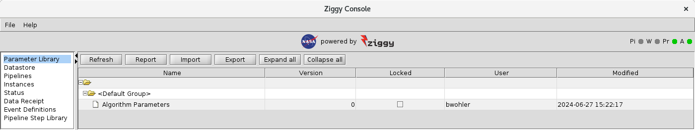
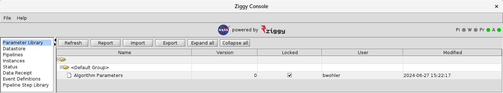
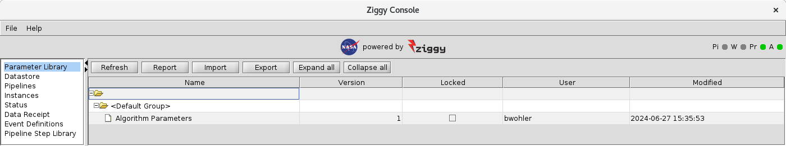
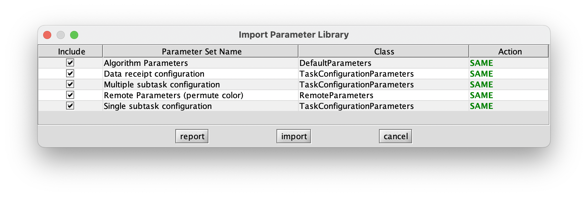

<!-- -*-visual-line-*- -->

[[Previous]](more-rdbms.md)
[[Up]](dusty-corners.md)
[[Next]](redefine-pipeline.md)

## More on Parameter Sets

Without further ado, let's talk parameter sets!

### Parameter Set Version Control

When you first start the cluster and launch a console, after initializing the cluster, the parameter set panel looks like this:

All the parameter sets are listed as version 0, the "Locked" boxes are all unchecked, and the "Mod. Time" column values are all pretty close to the same.

After running the sample pipeline, what you see is more like this:

The same as before, but all the "Locked" boxes are checked.

Now let's modify the `Algorithm Parameters` parameter set in any old way and save the result:

The modified parameter set has a new version number, and its "Locked" box is unchecked.

What you're seeing here is the parameter set version control system at work. A parameter set that's never been used is unlocked. This means that you can make whatever changes you want, and it will still show the same version number (so for example, if you were to further modify `Algorithm Parameters`, the version number would still be 1). Once a parameter set is passed to a pipeline instance, the parameter set is locked. At this point, any changes you make will result in a new version number (and the new version will be unlocked).

Ziggy preserves all versions of all parameter sets in its relational database. It also preserves the linkage between a given version of a parameter set and all the pipeline tasks that used that version. This means that you can always look back at some processing activity and see the parameter sets, and the values of their parameters, that were used for that activity.

### Import and Export

The `Import` and `Export` buttons control relations between the cluster and parameter library XML files.

#### Parameter Export

The `Export` button writes the current state of the parameter library to an XML file, in the same format used for the initial definition of the parameter library (see [the article on algorithm parameters](algorithm-parameters.md) for more information). You'll get a `Save As`-style dialog box that allows you to select the directory and the filename for the export.

#### Parameter Import

The `Import` button does the reverse of `Export`: it allows the user to specify an XML file that should be imported into the cluster.

Let's try this: use the `Import` button to read in the XML file that the `Export` command wrote out. When you do this, the following dialog box pops up:

What's this all about?

The `Action` column tells you how, if at all, each parameter set differs from the current version of that set in the database. None of these parameters have been touched, so they're all `SAME`. The other options for the `Action` column are as follows:

- `UPDATE`: the parameter set exists in the database and also in the XML file, but the values in the XML file are different. If this parameter set is imported, the database version will be updated (including the creation of a new version, if the current database version is locked).
- `CREATE`: the parameter set exists in the XML file but not in the database. If this parameter set is imported, it will be created in the database with version 0 and in the unlocked state.
- `LIBRARY_ONLY`: the parameter set exists in the database but not in the XML file. Obviously, if you "import" this parameter set, nothing will happen because there's nothing to import.

The `Include` column lets you select exactly which parameter sets you're going to import. This means that if you have an XML file that has a bunch of changed parameter sets, you can pick and choose which ones will be imported and which will be left as-is in the database.

[[Previous]](more-rdbms.md)
[[Up]](dusty-corners.md)
[[Next]](redefine-pipeline.md)
