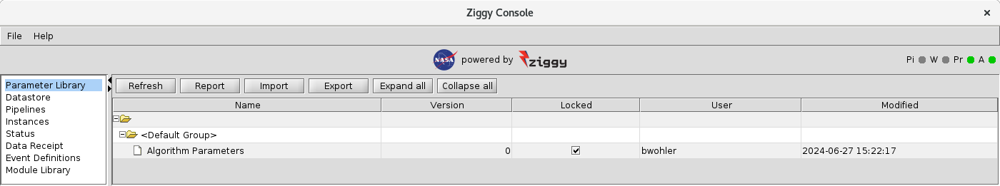
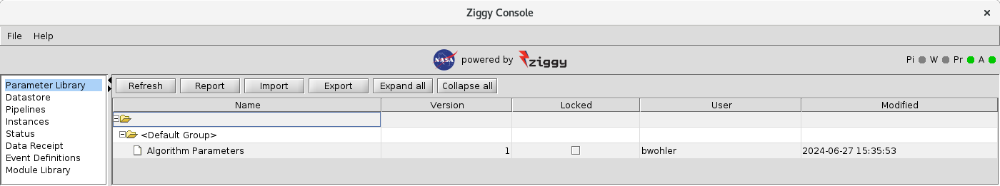
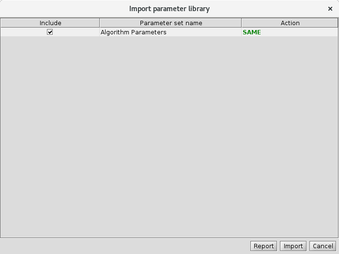

<!-- -*-visual-line-*- -->

[[Previous]](more-rdbms.md)
[[Up]](dusty-corners.md)
[[Next]](parameter-overrides.md)

## More on Parameter Sets

Without further ado, let's talk parameter sets!

### Parameter Set Version Control

When you first start the cluster and launch a console, after initializing the cluster, the parameter set screen looks like this:


All the parameter sets are listed as version 0, the "Locked" boxes are all unchecked, and the "Mod. Time" column values are all pretty close to the same. 

After running the sample pipeline, what you see is more like this:



The same as before, but all the "Locked" boxes are checked. 

Now let's modify the `Algorithm Parameters` parameter set in any old way and save the result:



The modified parameter set has a new version number, and its "Locked" box is unchecked. 

What you're seeing here is the parameter set version control system at work. A parameter set that's never been used is unlocked. This means that you can make whatever changes you want, and it will still show the same version number (so for example, if you were to further modify `Algorithm Parameters`, the version number would still be 1). Once a parameter set is passed to a pipeline instance, the parameter set is locked. At this point, any changes you make will result in a new version number (and the new version will be unlocked). 

Ziggy preserves all versions of all parameter sets in its relational database. It also preserves the linkage between a given version of a parameter set and all the pipeline tasks that used that version. This means that you can always look back at some processing activity and see the parameter sets, and the values of their parameters, that were used for that activity. 

### Import and Export

The `Import` and `Export` buttons control relations between the cluster and parameter library XML files.

#### Parameter Export

The `Export` button writes the current state of the parameter library to an XML file, in the same format used for the initial definition of the parameter library (see [the article on module parameters](module-parameters.md) for more information). You'll get a `Save As`-style dialog box that allows you to select the directory and the filename for the export. 

The exported file will provide a modicum of additional information relative to the original XML you used to import the parameters. To see what I mean, let's look at the representation of the `Algorithm Parameters` parameter set in the export file:

```XML
<parameter-set name="Algorithm Parameters" version="1" locked="false"     classname="gov.nasa.ziggy.parameters.DefaultParameters">
    <parameter name="produce output subtask 1" value="true" type="boolean"/>
    <parameter name="execution pause seconds" value="5" type="int"/>
    <parameter name="dummy array parameter" value="1,2" type="intarray"/>
    <parameter name="throw exception subtask_0" value="false" type="boolean"/>
</parameter-set>
```

One thing you see is that Ziggy includes the Java class that supports the parameter set. In this case, that's the `DefaultParameters` class. As we saw earlier, parameter sets like `Algorithm Parameters` don't need to specify their Java class, because Ziggy knows that if there's no class specified, it should use `DefaultParameters`. Nonetheless, on export Ziggy always specified the Java class, even for parameter sets where the user didn't need to define the class during import. 

The other thing you notice is that the version number and the lock state are explicitly shown. 

#### Parameter Import

The `Import` button does the reverse of `Export`: it allows the user to specify an XML file that should be imported into the cluster. 

Let's try this: use the `Import` button to read in the XML file that the `Export` command wrote out. When you do this, the following dialog box pops up:



What's this all about? 

The `Action` column tells you how, if at all, each parameter set differs from the current version of that set in the database. None of these parameters have been touched, so they're all `SAME`. The other options for the `Action` column are as follows:

- `UPDATE`: the parameter set exists in the database, but the values in the XML file are different. If this parameter set is imported, the database version will be updated (including the creation of a new version, if the current database version is locked).
- `CREATE`: the parameter set does not exist in the database. If this parameter set is imported, it will be created in the database with version 0 and in the unlocked state.
- `LIBRARY_ONLY`: the parameter set exists in the database but not in the XML file. Obviously, if you "import" this parameter set, nothing will happen because there's nothing to import. 

The `Include` column lets you select exactly which parameter sets you're going to import. This means that if you have an XML file that has a bunch of changed parameter sets, you can pick and choose which ones will be imported and which will be left as-is in the database. 

### New Parameter Set

This allows a user to create a new parameter set via the console, without an XML file. Or at least it's supposed to. It doesn't work correctly at the moment. We'll let you know when it's fixed. 

### Adding or Removing Parameters

As we discussed in [the module parameters article](module-parameters.md), the user can define parameter sets for use by the processing algorithms in a fairly general way: in one of the parameter library files (i.e., the `pl-*.xml` files), define the parameter set name, the names of each parameter, the type of each parameter (including whether it's a scalar value or a 1-d array), and the initial value of the parameter. When you initialize the cluster, the parameter library XML files are read into the database. If you need to change a parameter value, you have numerous options, as described above. 

So far, so good. But now imagine that, as your mission continues, the algorithms are gradually improved in ways that require additional module parameters. What are your options?

Option one is to define a new parameter set for the new parameters, put it into a parameter library file, and use `runjava pl-import` to pull it into the database. This works, but it's kind of unsatisfying. For one thing, you also need to redefine the pipeline so that the new parameter set is provided to the algorithm (see [the article on redefining pipelines](redefine-pipeline.md) for more information). For another thing, it may be the case that the logical way to organize parameters would've put the new ones into an existing parameter set; if you use a new parameter set, you wind up diluting the benefits of organizing parameters into parameter sets in the first place. Also, once you've gone through a few cycles of algorithm improvement, you can wind up with a lot of parameter sets that really should be merged together. 

Given the above, what you really want is the ability to add or remove parameters from existing parameter sets, either from the console or via an XML file. 

As it happens, this capability is broken, too. We'll let you know when it's fixed. 

[[Previous]](more-rdbms.md)
[[Up]](dusty-corners.md)
[[Next]](parameter-overrides.md)