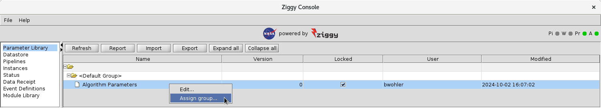
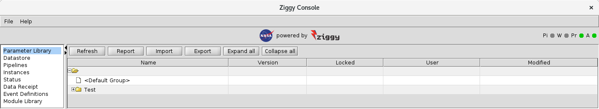
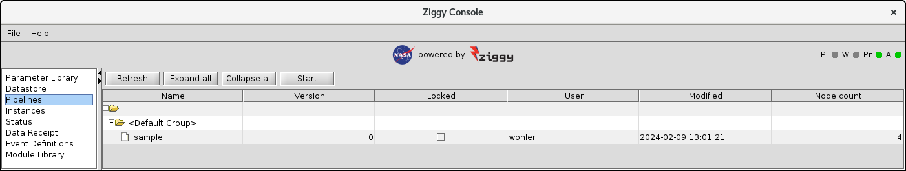

<!-- -*-visual-line-*- -->

[[Previous]](change-param-values.md)
[[Up]](ziggy-gui.md)
[[Next]](edit-pipeline.md)

## Organizing Pipelines and Parameter Sets

The sample pipeline, as discussed earlier, is a pretty trivial example of what you can do with Ziggy. There's only one pipeline defined (`sample`), and only 1 parameter set.

In real life, you may well wind up with a configuration that is, shall we say, somewhat richer. For example, the current TESS science data processing system has over a dozen pipelines and over 100 parameter sets! There are pipelines and parameter sets that are only used in system testing; pipelines and parameter sets that are targeted to one of the three types of flight data acquired by the instruments; pipelines and parameter sets that were used earlier in the mission but are now obsolete; and so on.

In a system as complex as the TESS pipeline, how is a user supposed to be able to manage the potential deluge of pipeline elements that potentially need to be used, updated, and configured?

### Introducing Groups

Let's take another look at the parameter library display:

The display shows the single parameter set under an icon labeled `<Default Group>`. If you right-click on a parameter set, you get the following context menu:

You probably get an intuitive sense that the `Assign group...` command is something that will assist you in organizing the content of the parameter library display. Run the `Assign group...` command, and you get a dialog box:

Well, that's underwhelming.

The issue here is that there aren't any groups defined "out of the box" except for the default group. To add a group, enter a group name in the text box under `Add/remove group`, and press the `+` button:

If you now press the `OK` button, you'll see the following change to the parameter library display:

The `Algorithm Parameters` parameter set is no longer visible, but there's a spot in the table for the `Test` group defined previously. If you click the `+` button next to `Test` to expand the group, you see this:

Okay, now this is starting to look promising! To summarize:

- The user can define groups, which are a kind of container that parameter sets can be assigned to.
- Once assigned to a group, a parameter set shows up in the display table as belonging to the group it's been assigned to.
- Groups can be expanded or collapsed using appropriate mouse clicks on the table (or via the `Expand all` and `Collapse all` buttons at the top). This allows you to, in effect, conceal parameter sets when they aren't relevant to your current activity (by collapsing the groups of not-currently-relevant parameter sets) so you can focus on the ones you currently care about.
- Though we haven't demonstrated it here, you can move a parameter set back to the `Default Group` via the `Select group` dialog box: check the box next to `Default group`, and press the `OK` button.

With this wisdom in hand, let's look again at the `Pipelines` panel:

Based on our experience with parameter sets, it's now clear that we can group pipelines in the same way that we can group parameter sets. Given that there's only one pipeline in the sample, it would be as ludicrous as our example above, but someday when you've got a couple of dozen actual pipelines you'll thank us for this.

[[Previous]](change-param-values.md)
[[Up]](ziggy-gui.md)
[[Next]](edit-pipeline.md)