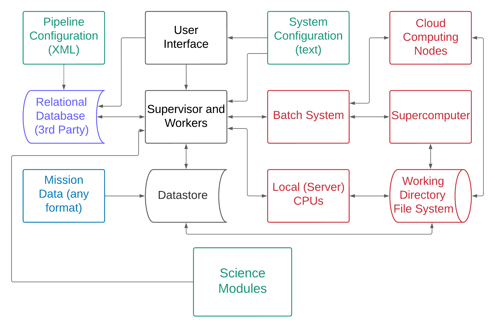

[[Previous]](system-requirements.md)
[[Up]](user-manual.md)
[[Next]](downloading-and-building-ziggy.md)

## Pipeline Architecture

As a general matter, it's not necessary to know much about the inner workings of Ziggy in order to use it. In the sections below we cover the things you actually do need to know. 

### Architecture Diagram

The figure above shows Ziggy's architecture. Boxes in green (Algorithms, Pipeline Configuration, System Configuration) are the components that users need to supply or manage. Boxes in black (Datastore, Worker, User Interface) are parts of Ziggy. Boxes in red (Batch System, Cloud Computing Nodes, Local CPUs, Supercomputer, Working Directory File System) are system resources (note that you don't need to have *all* the components in red to make Ziggy work, so if you don't own a supercomputer or a batch system, don't panic). The box in purple is a relational database management system (RDBMS): Ziggy uses a Commercial Off-the-Shelf (COTS) database program (specifically, Postgresql), but the content in that database is generated by Ziggy. The blue box is mission data: this includes data from the instrument(s), instrument models (i.e., descriptions of the instruments that are needed for processing), etc. This is information that presumably flows to the pipeline at regular intervals and gets processed or reprocessed. 

A particular instance of the system above is called a **cluster**. A complete processing system may consist of more than one cluster: for example, the TESS processing pipeline has 4 clusters, each of which processes a different subset of TESS data. A single server can run multiple pipeline clusters, though that gets potentially messy. For now, let's stick with the assumption that on a given computer there's only one cluster in existence at a time.

[[Previous]](system-requirements.md)
[[Up]](user-manual.md)
[[Next]](downloading-and-building-ziggy.md)
