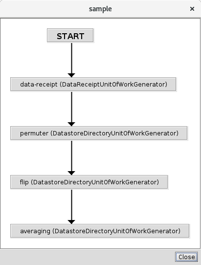
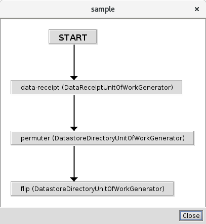

<!-- -*-visual-line-*- -->

[[Previous]](parameter-overrides.md)
[[Up]](dusty-corners.md)
[[Next]](nicknames.md)

## Redefining a Pipeline

Something that does happen in the course of a typical science mission is that the mission's data analysis needs change. Sometimes this is because the subject matter experts come up with a better or more efficient set of algorithms. Sometimes this is because, once the mission is collecting real data, folks realize that the original algorithms aren't sufficient and need to be updated, including occasionally adding whole new algorithms into the processing sequence. Sometimes it's because the science instruments change with time in ways that require algorithm changes or new parameter sets or ... something.

The good news is that it's straightforward to update a pipeline definition in Ziggy, and that Ziggy preserves a permanent record of all versions of all pipelines, so you don't lose the records of what you did in the past when you change what you want to do in the future. The bad news is that this can't be done from the console, but only via a `ziggy` command (see [the article on running the cluster](running-pipeline.md) for a refresher on the `ziggy` command system).

To see this in action, open up the Pipelines panel, select the sample pipeline, and run the `View` command from the context menu. You'll see this:



This shows the modules in the pipeline and their order of execution.

Now let's assume that something has happened and you decide that you want to get rid of the averaging step at the end. Here's how you go about that:

**Create a New Pipeline Definition XML File:** first you need a new version of the pd-sample.xml file that has your changes. In the interest of saving everyone time and effort, we've included a modified file for you, it's `sample-pipeline/config-extras/pd-sample.xml` . Here we've deleted the `averaging` node from the end of the pipeline, and removed from `flip` the name of its child node (since it no longer has a child node).

Note that in this case we've done the simplest possible change, but in real life you can add nodes, rearrange nodes, change parameter sets, etc.

**Run the Pipeline Definition Importer:** The relevant ziggy command here is:

```bash
$ ziggy import-pipelines sample-pipeline/config-extra/pd-sample.xml
```

You'll get a big spew of logging output that should not end with any Java stack traces.

**Refresh the Pipelines Panel:** Press the `Refresh` button in the pipelines panel. Again, select the sample pipeline, and run the `View` command from the context menu. You'll now see this:



As advertised, the averaging module has been removed from the end of the pipeline.

And that's all there is to it!

[[Previous]](parameter-overrides.md)
[[Up]](dusty-corners.md)
[[Next]](nicknames.md)
