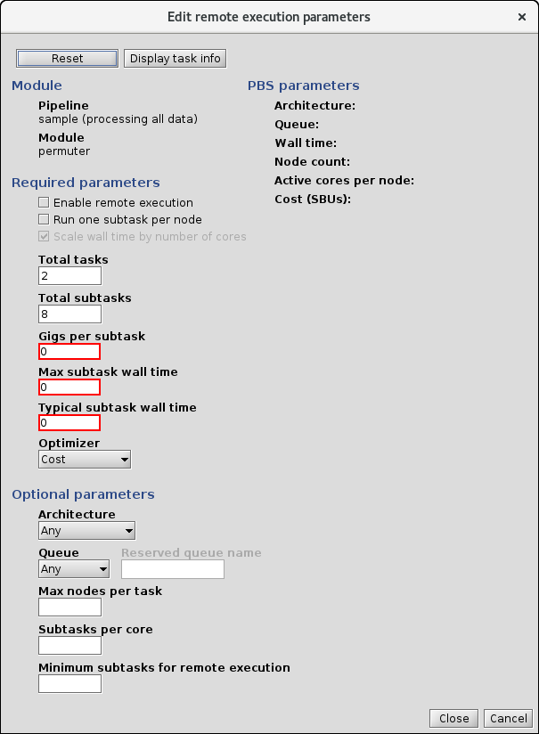

<!-- -*-visual-line-*- -->

[[Previous]](select-hpc.md)
[[Up]](advanced-topics.md)
[[Next]](hpc-cost.md)

## The Remote Execution Dialog Box

When you submit a job request to the batch system for an HPC facility, it typically wants you to specify your request in "machine-centric" units: how many compute nodes, of what kind, for how long? Meanwhile, what you know is something about the resources that each subtask will likely need (RAM and CPU hours), you may or may not know how many subtasks there are, and you probably care about things like, "How long will this take?", "How much will it cost?", and "How long will my jobs be stuck in the queue?"

Ziggy provides a tool that can get you from what you know and/or care about to what PBS needs.

### Opening the Remote Execution Dialog Box

Go to the `Triggers` tab and double-click on the sample pipeline row in the table. You'll see this:

A whole new dialog box we've never seen before! But actually we're just going to use it to get to yet another one. Select `permuter` from the modules list and press `Remote Execution`. You'll see this:

### Using the Remote Parameters Dialog Box

Notice that the values you've set in the `RemoteParameters` instance for permuter have been populated, as has the total number of subtasks that Ziggy found for this node, based on the contents of the datastore. In the interest of making this more realistic, change the number in `Total subtasks` to 1000, then hit the `Calculate Pbs Parameters` button. You'll see this:

The parameters that will be used in the request to PBS are shown in the `PBS Parameters` box. Ziggy will ask for 84 nodes of the Haswell type, for 15 minutes each; the total cost in Standard Billing Units (SBUs) will be 16.8.

A Haswell node at the NAS has 24 cores and 128 GB of RAM. Since we've asserted that each subtask takes 10 GB, then a maximum of 12 subtasks will run in parallel on each node, and thus there will be 12 active cores per node (and 12 idled).

What did Ziggy actually do here? Given the parameters we supplied, Ziggy looked for the architecture that would minimize the cost in SBUs, which turns out to be Haswell, and it asked for enough nodes that all of the subtasks could execute in parallel. This latter minimizes the estimated wall time, but at the expense of asking for a lot of nodes.

#### Setting the Maximum Number of Nodes

Given the above, it might be smarter to ask for fewer nodes. If we change the `Max Nodes` value to 10 and press `Calculate PBS Parameters`, this is what we see:

As expected, the number of remote nodes went down and the wall time went up. What's unexpected is that the total cost also went down! What happened?

This is due to the confluence of two factors. First, Ziggy always rounds its wall time requests up to the nearest quarter-hour. Second, Ziggy doesn't use the max nodes as a parameter it tries to adjust to minimize the cost.

In the first example, Each node was really going to be needed for 0.15 hours, based on the wall time estimates we provided. Because of the round-up, it asked for them for 0.25 hours each. Thus the request was asking for an extra 0.1 hours per node; multiply by 84 nodes and it starts to add up.

In the second example, given the parameters requested, the actual wall time needed would be -- 1.25 hours, so exactly what Ziggy requested (i.e., the round-up is miniscule). Thus the second example has a lower total cost.

That said: Once the HPC has processed all the subtasks, the jobs all exit and the nodes are returned to the HPC pool. The user is only charged for the actual usage. In the first case, what would have happened is that all the jobs would finish early, and we'd only get billed for what we actually used, which would be more like 10 SBUs than 17 SBUs.

#### Selecting a Different Optimizer

Right now the `Optimizer` is set to `COST`, meaning that Ziggy will attempt, within the limits of its smarts, to find the compute node architecture that minimizes the cost in SBUs. There are 3 other settings available for the optimizer: `CORES`, `QUEUE_DEPTH`, and `QUEUE_TIME`. These are described in detail in the article on [Remote Parameters](remote-parameters.md).

#### Manually Selecting an Architecture

The `Architecture` pull-down menu allows you to manually select an architecture for the compute nodes. This in turn allows you to run the wall time and SBU calculation and see the results for each architecture.

#### Enabling or Disabling Node Sharing

So far we've implicitly assumed that each compute node can run subtasks in parallel up to the limit of the number of active cores per node. That is to say, in this example a Haswell node will always have 12 permuter subtasks running simultaneously. This is the situation we call "Node Sharing."

There are cases when this won't be true -- when it won't be safe to try to force a node to run many subtasks in parallel. In those cases, you can uncheck the Node Sharing check box and run the PBS parameter calculation. You get this:

Ziggy no longer asks about GB per subtask, because only 1 subtask will run at a time on each node, so there's an assumption that the available RAM on any architecture will be sufficient. The cost has ballooned, which is expected since now each node can only process 1 subtask at a time. Somewhat unexpectedly, the optimal architecture has changed. This is because, with each node processing 1 subtask at a time, the benefits to having a lot of cores in a compute node go away and architectures with fewer cores are potentially favored.

Now: hopefully, the reason you're disabling node sharing is because your algorithm program has its own, internal concurrency support, and that support spreads the work of the subtask onto all the available cores on the compute node. When this is the case, check the `Wall Time Scaling` box. When this box is checked, Ziggy assumes that the wall times provided by the user are wall times for processing on 1 core, and that the actual time will go inversely with the number of cores (i.e., the parallelization benefit is perfect). When you do this and calculate the parameters, you see this:

This results in a cost even lower than what we saw before! This is because, in this configuration, Ziggy assumes that every core can be utilized regardless of how much RAM per core the architecture has.

### Keeping or Discarding Changes

After some amount of fiddling around, you may reach a configuration that you like, and you'd like to ensure that Ziggy uses that configuration when it actually submits your jobs. To make that happen, press the `Save to DB` button. Ziggy will update the `RemoteParameters` instance that goes with this node according to your settings.

Alternately, you may want to discard all your changes and start over tuning the remote configuration from the original values. To do this, select `Reset to DB Values`.

[[Previous]](select-hpc.md)
[[Up]](advanced-topics.md)
[[Next]](hpc-cost.md)
