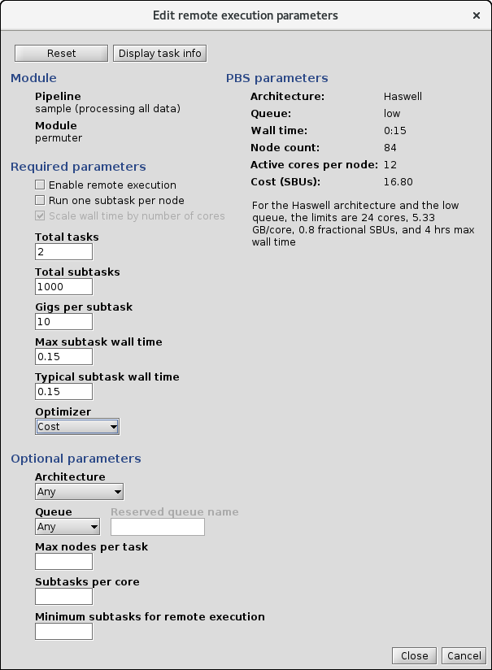
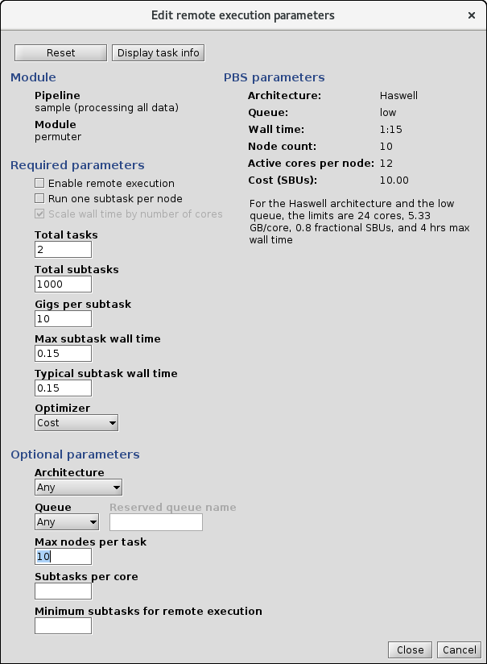

<!-- -*-visual-line-*- -->

[[Previous]](select-hpc.md)
[[Up]](select-hpc.md)
[[Next]](hpc-cost.md)

## The Remote Execution Dialog Box

When you submit a job request to the batch system for an HPC facility, it typically wants you to specify your request in "machine-centric" units: how many compute nodes, of what kind, for how long? Meanwhile, what you know is something about the resources that each subtask will likely need (RAM and CPU hours), you may or may not know how many subtasks there are, and you probably care about things like, "How long will this take?", "How much will it cost?", and "How long will my jobs be stuck in the queue?"

Ziggy provides a tool that can get you from what you know and/or care about to what PBS needs.

### Opening the Remote Execution Dialog Box

Go to the `Pipelines` panel and double-click on the sample pipeline row in the table. You'll see this:

Now select `permuter` from the modules list and press `Remote execution`. You'll see this:

### Using the Remote Execution Dialog Box

The first thing to notice is that there are some parameters that are in a group labeled Required parameters, and other in a group labeled Optional parameters. Let's talk first about the ...

#### Required Parameters

##### Enable remote execution

This is the one that tells Ziggy that you want to run this pipeline module on a high performance computing system of some sort. Obviously when the check box is checked, Ziggy will farm out the module execution to the appropriate batch system; when it's unchecked, Ziggy will run all the tasks on the local system (i.e., the system where the Ziggy process is running). Ziggy will not let you save the configuration via the `Close` button until all of the required parameters have been entered.

##### Run one subtask per node

This one's a bit tricky to explain, so bear with me.

The usual way that Ziggy performs parallel execution on a remote system is that it starts a bunch of compute nodes and then, on each compute node, as many subtasks as possible run in parallel, depending on the number of cores and amount of RAM on the compute node. The advantage of this is that the folks who write the algorithm code don't need to do anything special to their software to take advantage of parallel execution: just plug your algorithm in and let Ziggy do the rest.

In some cases, though, there are algorithm packages that have their own parallelization that was implemented by the subject matter experts. Typically these algorithms make use of one of many third-party concurrency libraries available for most computer languages. In these cases, you probably don't want multiple subtasks all vying for the CPUs and RAM on a compute node; you want one subtask to run on the compute node, and that subtask should farm out work using its own parallel processing capabilities.

In this latter case, you should check the `Run one subtask per node` check box. This tells Ziggy to defer to the algorithm's parallelism and not to try to use Ziggy's subtask parallelism.

##### Total tasks and subtasks

The total number of tasks and subtasks.

If the datastore already has the input files for the module you're working on, then Ziggy can figure out how many tasks will be needed, and how many subtasks each task will need (it does this by running the code that's used by Ziggy to determine the task and subtask populations). In this example, because Data Receipt has been run, Ziggy knows how to set the task and subtask count parameters for Permuter (which gets all its inputs from the files that got read in by Data Receipt). Consequently, it will do so automatically.

On the other hand, consider the case in which the inputs to a module do not yet exist. For example, imagine that we've just run data receipt but none of the other pipeline modules. If you ask for remote execution parameters for Permuter, it can figure out the task and subtask counts. On the other hand, if you try to generate remote execution parameters for Flip, it will show 0 tasks and 0 subtasks. This is because Flip's inputs are Permuter's outputs. If Permuter hasn't yet generated its outputs, there's nothing there to let Ziggy do the task/subtask calculation for Flip. In this case, if you want to generate remote parameter estimates, you'll need to fill in estimates for the task count and subtask count yourself.

Note that, even in the case in which Ziggy can fill in task and subtask counts, you can delete the values it comes up with and put in your own! This is helpful when you've just used a small run to determine things like the gigs per subtask, and now you want to see how performance will scale to a much larger run.

##### Gigs per subtask

This is the maximum amount of RAM you expect a single subtask to consume at any given time in its execution, in gigabytes.

##### Max subtask wall time and Typical subtask wall time

These are estimates of how much time a subtask will need in order to finish. In general, subtask wall times will have a distribution, with most tasks executing in a time X while a few stragglers will require a time Y > X. Enter the "most tasks time," X, for `Typical subtask wall time` and the "stragglers time," Y, for `Max subtask wall time`.

##### Scale wall time by number of cores

This option is only used when `Run one subtask per node` is enabled.

The issue here is that the wall time needed for each subtask depends on the number of cores in a given node. If a subtask runs on a node with 32 cores, it will probably need only half as much wall time as if it runs on one with 16 cores.

To ensure that the wall time is set correctly on any compute node, no matter how many cores it has, the user can enter in the `Max subtask wall time` and `Typical subtask wall time` the time that subtasks will take if they're given only 1 core. When the compute node architecture is selected, Ziggy will scale down the wall time by the number of cores in that architecture, assuming a simple linear scaling.

#### Calculate the PBS Parameters

Once the required parameters have been entered, Ziggy will convert the remote execution parameters on the left hand side of the dialog box into the parameters that will be used in the PBS submission if and when you run this module on the HPC system. In this example, the PBS parameters have not been generated because the gigs per subtask and wall time per subtask are set to zero. Note that Ziggy highlights those incomplete fields. The total tasks and total subtasks fields have been auto-filled with a value of 2 and 8 respectively, which is correct but not very interesting. For the purposes of the example, let's set `Total subtasks` to 1000, `Gigs per subtask` to 10, and both wall time parameters to 0.15 hours. You'll see this:

The parameters that will be used in the request to PBS are shown in the `PBS parameters` section. Ziggy will ask for 84 nodes of the Haswell type, for 15 minutes each; the total cost in Standard Billing Units (SBUs) will be 16.8.

A Haswell node at the NAS has 24 cores and 128 GB of RAM. Since we've asserted that each subtask takes 10 GB, then a maximum of 12 subtasks will run in parallel on each node, and thus there will be 12 active cores per node (and 12 idled).

What did Ziggy actually do here? Given the parameters we supplied, Ziggy looked for the architecture that would minimize the cost in SBUs, which turns out to be Haswell, and it asked for enough nodes that all of the subtasks could execute in parallel. This latter minimizes the estimated wall time, but at the expense of asking for a lot of nodes.

We can now tune the PBS request that Ziggy makes on our behalf by making use of ...

#### Optional Parameters

The optional parameters are there in case Ziggy produces a ludicrous PBS request, and you want to apply some additional limits to get the request to be less insane.

##### Maximum nodes per task

Given the above, it might be smarter to ask for fewer nodes. If we change the `Max nodes` value to 10, this is what we see:

As expected, the number of remote nodes went down and the wall time went up. What's unexpected is that the total cost also went down! What happened?

This is due to the confluence of two factors. First, Ziggy always rounds its wall time requests up to the nearest quarter-hour. Second, Ziggy doesn't use the max nodes as a parameter it tries to adjust to minimize the cost.

In the first example, each node was really going to be needed for 0.15 hours, based on the wall time estimates we provided. Because of the round-up, it asked for them for 0.25 hours each. Thus the request was asking for an extra 0.1 hours per node; multiply by 84 nodes and it starts to add up.

In the second example, given the parameters requested, the actual wall time needed would be -- 1.25 hours, so exactly what Ziggy requested (i.e., the round-up is miniscule). Thus the second example has a lower total cost.

That said: Once the HPC has processed all the subtasks, the jobs all exit and the nodes are returned to the HPC pool. The user is only charged for the actual usage. In the first case, what would have happened is that all the jobs would finish early, and we'd only get billed for what we actually used, which would be more like 10 SBUs than 17 SBUs.

##### Optimizer

When Ziggy does its calculations, its default behavior is to select an architecture that minimizes the total cost (in SBUs for NASA's supercomputer, dollars or other currency for other systems). This is reflected in the `Cost` setting of the `Optimizer`. This is the default, but there are three other options:

- `Cores`: As mentioned above, depending on the amount of RAM required for each subtask, you may find that, on some or even all architectures, it's not possible to run subtasks in parallel on all the cores; in order to free up enough RAM for the subtasks, some cores must be idled. The `Cores` option minimizes the number of idled cores.
- `Queue depth`: This is one of the optimizers that tries to minimize the time spent waiting in the queue. The issue here is that some architectures are in greater demand than others. The `Queue depth` optimization looks at each architecture's queued jobs and calculates the time it would take to run all of them. The architecture that has the shortest time based on this metric wins.
- `Queue time`: This is a different optimization related to queues, but in this case it attempts to minimize the total time you spend waiting for results (the time in queue plus the time spent running the jobs). This looks at each architecture and computes the amount of queue time "overhead" that typical jobs are seeing. The architecture that produces the shortest total time (queue time plus execution time) wins.

##### Architecture

The `Architecture` pull-down menu allows you to manually select an architecture for the compute nodes rather than allowing Ziggy to try to pick one for you. The console will show you the capacity and cost of the selected architecture to the right of the combo box as well as the estimated wall time and SBU calculation for that architecture in the `PBS parameters` section.

##### Subtasks per core

The `Subtasks per core` option does something similar to the `Max nodes per task` option. Both of these options tell Ziggy to reduce its node request in exchange for asking for a longer wall time. The difference is that the `Max nodes per task` option does this explicitly, by setting a limit on how many nodes Ziggy can ask for. `Subtasks per core`, by contrast, applies an implicit limit. In the default request, Ziggy will ask for enough nodes that every core processes one and only one subtask, so that all the subtasks get done in one "wave," as it were. The `Subtasks per core` option tells Ziggy to tune its request so that each active core processes multiple subtasks, resulting in a number of "waves" of processing equal to the `Subtasks per core` value.

#### Selecting A Batch Queue

Under ordinary circumstances, it's best to leave the Queue selection blank so that it can be selected based on the required execution time resources. There are two non-ordinary circumstances in which it makes sense to select a queue manually.

The first circumstance is when you are using a reserved queue. In this case, when you select Reserved in the Queue selection box, the Reserved queue name text field will be enabled and can enter your reservation queue, which is named with the letter R followed by a number.

The second circumstance is when you want to use either the `Devel` or the `Debug` queue on the NASA Advanced Supercomputer (NAS). These are special purpose queues that allow users to execute jobs at higher priority but which set a low limit on the number of nodes (2 and 1 respectively) and amount of wall time that can be requested. Ziggy will never select these queues for you, but if you think you should use them you can select them yourself.

If you select either of these two queues, the maximum number of nodes field is filled in for you. In addition, you also have to ensure that you only have 1 or 2 tasks respectively. In the case of the sample pipeline, you can change the unit of work so that a single task is generated. To do this, go to the `Datastore` panel and set the `dataset` regexp to `set-1`. When you start the Permuter module, you'll find that only one task--the one associated with the set-1 directory--will start.

In any case, it may be instructive to select the various queues to see the maximum wall times for each queue displayed to the right of the combo box.

### Keeping or Discarding Changes

After some amount of fiddling around, you may reach a configuration that you like, and you'd like to ensure that Ziggy uses that configuration when it actually submits your jobs. Alternately, you might realize that you've made a total mess and you want to discard all the changes you've made and start over (or just go home).

Let's start with the total mess case. If you press the `Reset` button, the remote parameters will be set back to their values from when the Remote execution dialog opened. At this point you can try again. Alternately, if you've decided to give up on this activity completely, press the `Cancel` button: this will discard all your changes and close the Remote execution dialog box.

Alternately, you might think that your changes are pretty good and you want to hold onto them. If this is the case, press the `Close` button. This button saves your changes to the remote parameters, but **it only saves them to the Edit pipeline dialog box!** What this means is that if you hit `Close` and then press the `Remote execution` button on the Edit pipeline dialog box again, the values you see in the Remote execution dialog box will be the ones you saved earlier with the `Close` button. Relatedly, if you make a bunch of changes now and decide to use the `Reset` button, the values are reset to the ones you saved via the `Close` button in your prior session with the Remote execution dialog.

If you decide that you're so happy with your edits to remote execution that you want Ziggy to actually store them and use them when running the pipeline, you need to press the `Save` button on the Edit pipeline dialog. This will save all the changes you've made since you started the Edit pipeline dialog box. Alternately, if you realize that you've messed something up and want Ziggy to forget all about this session, you can use the `Cancel` button.

[[Previous]](select-hpc.md)
[[Up]](select-hpc.md)
[[Next]](hpc-cost.md)
