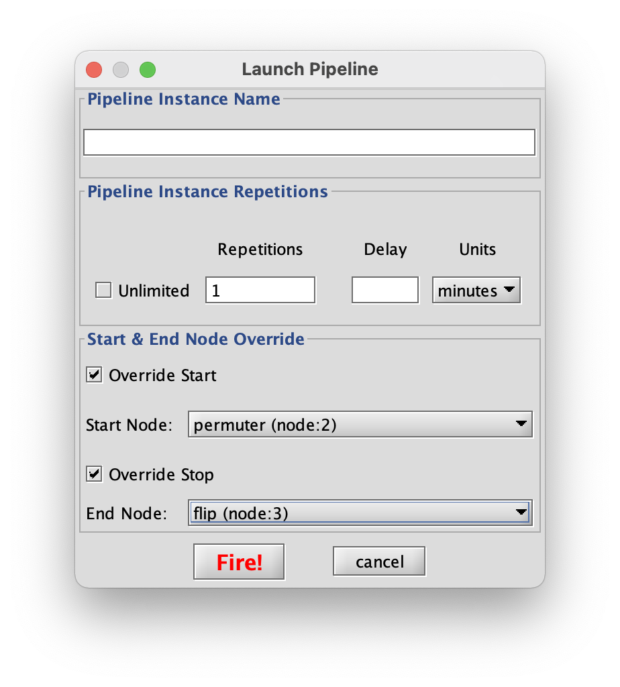
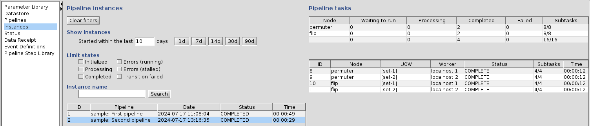

<a href="start-pipeline.md">[Previous]</a> <a href="ziggy-gui.md">[Up]</a> <a href="change-param-values.md">[Next]</a>

## Changing the Start and End Nodes

As you perform your data processing activities, it won't always be necessary to run the whole, entire pipeline. As a simple example: any time you're reprocessing, you won't need to re-run the data receipt step in any pipelines that start with data receipt.

Fortunately, Ziggy provides tools that allow you to manage these conditions.

To see how to do this, return to the `Triggers` panel, select the `sample` pipeline, and click the `Fire` Button. This time, though, when the Launch Pipeline dialog box appears, don't hit the `Fire!` button on the dialog box just yet. Instead, click the `Override Start` and `Override Stop` check boxes. This will allow you to use the pull-down menus to select a different start and end node. For example:

Now press the `Fire!` button and return to the `Instances` panel. The pipeline will be running instance 2, which will start with the `permuter` tasks. Eventually the panel will look like this:

As advertised, the pipeline ran again but this time it skipped data receipt and stopped short of the averaging tasks.

<a href="start-pipeline.md">[Previous]</a> <a href="ziggy-gui.md">[Up]</a> <a href="change-param-values.md">[Next]</a>
