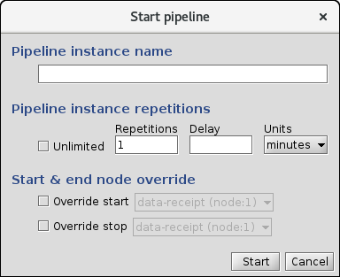
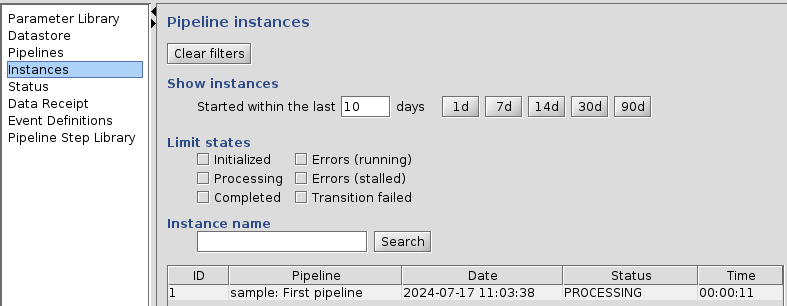
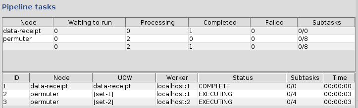
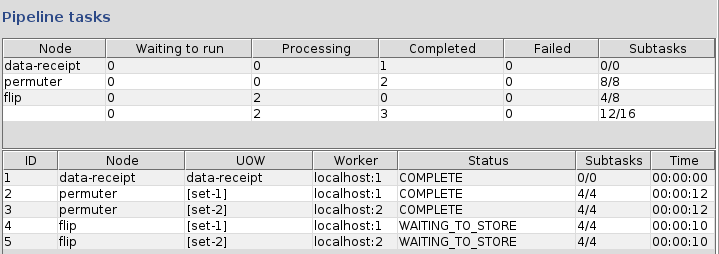
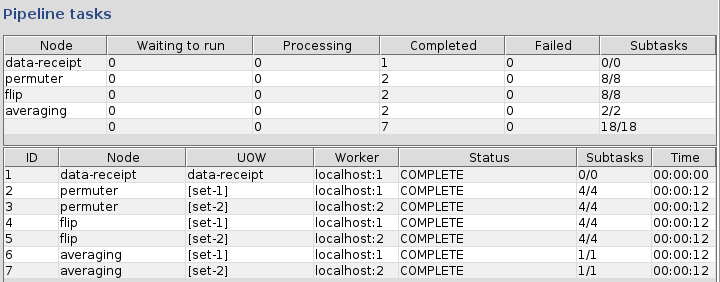

<!-- -*-visual-line-*- -->

[[Previous]](ziggy-gui.md)
[[Up]](ziggy-gui.md)
[[Next]](instances-panel.md)

## Starting a Pipeline

Let's do this.

### Get to the Pipelines Panel

The left-hand column is a *content menu* for the application. Select the `Pipelines` item and you should see this:

The table lists all the pipelines that are defined on this cluster, which in this case is just one, the sample pipeline.

Before we move on, there is a feature of the table headers that's worth pointing out. You can resize the columns by dragging the separators between the column names in the header. Double-clicking on a separator will shrink-wrap or enlarge the column to fit the data. Finally, columns can be hidden or exposed by using the context menu in the table header and checking or unchecking the boxes next to the column names in the popup menu. These features will come in handy later.

Moving on, select the sample pipeline since it's the only one we've got, and press the `Start` button.

### Start the Pipeline

A new dialog box will pop up that looks like this:

A lot of options! For now, just put some kind of identifying text in the `Pipeline instance name` text box and press the `Start` button.

### Monitor Progress

As soon as the dialog box disappears, select the `Instances` content menu item. The left side should look something like this1:

Select your pipeline instance in the table. On the right you see this:

Notice a few things:

1. In the upper-right corner (not shown in the screen shot), the grey lights for `Pi` (pipeline) and `W` (workers) have turned green. These 4 lights are known as Ziggy's "stoplights" (or somewhat more derisively, "idiot lights"). The first green light means that a pipeline is running; the second one means that Ziggy has one or more running workers. For more information, take a look at the article on the [Monitoring Tab](monitoring.md).
2. The left-hand table is now populated. It shows one entry, with ID 1. This is known as the `Instances` table.
3. There are 2 right-hand tables that are populated as well.
   1. The lower table is the "tasks table." It shows that data receipt already ran to completion, and that there are 2 permuter tasks that are running in series.
   2. The upper table is the "scoreboard." It shows -- something. Actually, the tasks table is pretty cryptic as well.

As you watch, the mysterious numbers in the last column of the task table change from `Ae (4 / 0 / 0)` to `Ae (4 / 1 / 0)`. The mysterious numbers in the scoreboard change in unison with the ones in the task table. Eventually the two pemruter tasks each hits `Ae (4 / 4 / 0)`. When that happens, they instantly change to `C (4 / 4 / 0)`, the State columns turn to `COMPLETED`, and two new tasks appear:

Finally, after a few more seconds, two new tasks, named `averaging`, appear. Shortly after that, we get to this state:

The pipeline and worker lights are grey again, the instance and all the tasks show `COMPLETED`. Congratulations! You've just run your first Ziggy pipeline!

At this point, you'd probably like an explanation of just what everything on the `Instances` panel is trying to tell you. If so, read on! Specifically, the article on [The Instances Panel](instances-panel.md).

1 The Event name column is initially hidden to save space. See the article [Event Handler Examples](event-handler-examples.md) for information on how to show and use this column.

[[Previous]](ziggy-gui.md)
[[Up]](ziggy-gui.md)
[[Next]](instances-panel.md)
