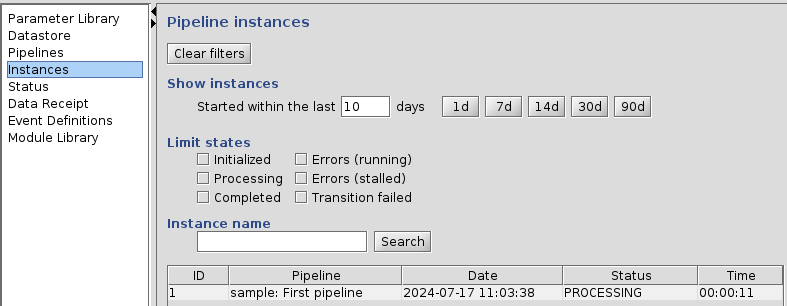
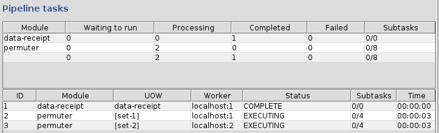
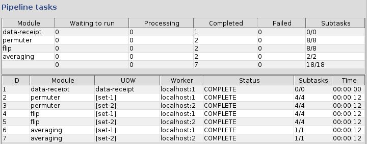

[[Previous]](ziggy-gui.md)
[[Up]](ziggy-gui.md)
[[Next]](instances-panel.md)

## Starting a Pipeline

Let's do this.

### Get to the Triggers Panel

On the top-left of the console is a tab, `Operations`. Select that and you should see this:

You see that there are now 2 tabs within the operations panel: `Instances` (where we are now) and `Triggers`. Select `Triggers` and you'll see this:

The table lists all the pipelines that are defined on this cluster, which in this case is just one, the sample pipeline. Since that's the only one we've got, select it and click the `Fire` button.

### Launch the Pipeline

A new dialog box will pop up that looks like this:

A lot of options! For now, just put some kind of identifying text in the `Pipeline Instance Name` text box and press the `Fire!` button.

### Monitor Progress

As soon as the dialog box disappears, click back to the `Instances` panel. The left side should look something like this:

Note: I cheated a bit and clicked on the one row in the table on the left. On the right you see this:

Notice a few things:

1. In the upper-right corner, the grey lights for `Pi` (pipeline) and `W` (worker threads) have turned green. These 4 lights are known as Ziggy's "stoplights" (or somewhat more derisively, "idiot lights"). The first green light means that a pipeline is running; the second one means that one or more of Ziggy's worker threads are occupied. For more information, take a look at the article on the [Monitoring Tab](monitoring.md).
2. The left-hand table is now populated. It shows one entry, with ID 1. This is known as the `Instances` table.
3. There are 2 right-hand tables that are populated as well.
   1. The lower table is the "tasks table." It shows that data receipt already ran to completion, and that there are 2 permuter tasks that are running in parallel.
   2. The upper table is the "scoreboard." It shows -- something. Actually, the tasks table is pretty cryptic as well.

As you watch, the mysterious numbers in the last column of the task table change from `Ae (4 / 0 / 0)` to `Ae (4 / 1 / 0)`. The mysterious numbers in the scoreboard change in unison with the ones in the task table. Eventually the two peruter tasks each hits `Ae (4 / 4 / 0)`. When that happens, they instantly change to `C (4 / 4 / 0)`, the State columns turn to `COMPLETED`, and two new tasks appear:

Finally, after a few more seconds, two new tasks, named `averaging`, appear. Shortly after that, we get to this state:

The pipeline and worker lights are grey again, the instance and all the tasks show `COMPLETED`. Congratulations! You've just run your first Ziggy pipeline!

At this point, you'd probably like an explanation of just what everything on the `Instances` panel is trying to tell you. If so, read on! Specifically, the article on [The Instances Panel](instances-panel.md).

[[Previous]](ziggy-gui.md)
[[Up]](ziggy-gui.md)
[[Next]](instances-panel.md)
