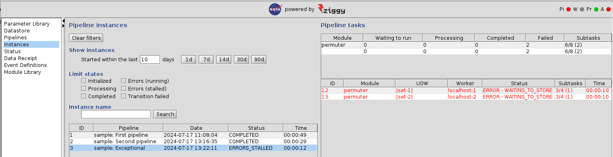

<!-- -*-visual-line-*- -->

[[Previous]](rdbms.md)
[[Up]](user-manual.md)
[[Next]](log-files.md)

## Troubleshooting Pipeline Execution

It's been said that the only things in life that are guaranteed are death and taxes, but software failures should probably be on that list as well. When you start setting up your own pipelines, sure as sugar you're going to encounter problems! Here's where we get started helping you figure out where it went wrong, why it went wrong, and how to get back on track.

### Creating an "Exception" in the Sample Pipeline

On the console, go back to the `Parameter Library` panel and double-click `Algorithm Parameters`. You'll see that there's a boolean parameter, `throw exception subtask 0`. Check the check box and save the parameter set.

What this does is to tell the permuter's Python-side "glue" code that it should deliberately throw an exception during the processing of subtask zero. Obviously you shouldn't put such a parameter into your own pipeline! But in this case it's useful because it allows us to generate an exception in a controlled manner and watch what happens.

Now go to the `Pipelines` panel and set up to run `permuter` and `flip` nodes in the sample pipeline. Start the pipeline and return to the `Instances` panel. After a few seconds you'll see that the `permuter` module has started, but then stops with an error:

What indications do we have that all is not well? Let me recount the signs and portents:

- The instance status is `ERRORS_STALLED`, which means that Ziggy can't move on to the next pipeline node due to errors.
- The task status has an `ERROR` prefix.
- The task's subtask counts are 3/4 (1). As expected, the 1 failed subtask showed up in the parenthesis (described in [The Instances Panel](instances-panel.md)).
- Both the `Pi` stoplight (pipelines) and the `A` stoplight (alerts) are red.

### [Log Files](log-files.md)

The first stop for understanding what went wrong is the log files. Ziggy produces a lot of these!

### [Using the Ziggy GUI for Troubleshooting](ziggy-gui-troubleshooting.md)

In most cases, you wan't want or need to resort to manually pawing through log files. In most cases, you can use Ziggy for troubleshooting and to respond to problems.

[[Previous]](rdbms.md)
[[Up]](user-manual.md)
[[Next]](log-files.md)